# C1 – System Context: Qorix Developer

## Overview

Qorix Developer is a system for designing, validating, and migrating AUTOSAR Classic & Adaptive configurations. It uses **YAML + Rust** as the primary working model, treating ARXML solely as an import/export format managed through a dedicated Spring Boot + ARTOP gateway.

---

## Mermaid Diagram

```mermaid
C4Context
    title System Context – Qorix Developer (Classic + Adaptive)

    Person(configEng, "Configuration Engineer", "Edits AUTOSAR configurations daily using YAML files and graphical designers. Triggers validation, code generation, and ARXML export.")
    Person(sysArch, "System Architect", "Designs system topology: ECU allocations, OS strategies (Classic) and application-to-machine mapping (Adaptive). Uses high-level canvases and validations.")
    Person(migEng, "Migration Engineer", "Migrates existing AUTOSAR projects from EB Tresos, Davinci, SystemDesk into Qorix. Uses ARXML import, migration diagnostics, and AI-assisted fixes.")

    System_Boundary(qorix, "Qorix Developer") {
        System(vscode, "VS Code Extension", "YAML editing with schema completion. Hosts Classic & Adaptive graphical designers. Integrates WASM for fast validation and MCP agent for AI workflows.")
        System(theia, "Theia IDE", "Alternative desktop/browser IDE. Shares identical contracts and APIs with VS Code extension.")
        System(rustDomain, "Rust Domain Service", "Canonical domain model and validation engine. Exposes HTTP/gRPC endpoints: /validate, /planOps, /applyOpsAndSync.")
        System(arxmlGateway, "ARXML Gateway", "Spring Boot + ARTOP + GraphQL. Handles ARXML import/export. Rust never touches EMF directly.")
        System(devAgent, "Developer Agent (MCP)", "Orchestrates AI between LLM backend and Rust Domain Service. Ensures all AI-proposed changes go through Rust ops and validation.")
        System(devCli, "Developer CLI", "Headless Rust CLI for CI/batch. Commands: validate, generate-arxml, migrate. Uses the same Rust domain core as IDE.")
    }

    System_Ext(llm, "LLM Backend", "External or on-prem LLM (OpenAI, self-hosted). Interprets natural language, proposes configuration changes, produces explanations.")
    System_Ext(legacyTools, "Legacy AUTOSAR Tools", "EB Tresos, Vector Davinci, dSPACE SystemDesk. Interact via ARXML. Qorix must import/export compatible ARXML.")
    System_Ext(buildToolchain, "Downstream Build Toolchain", "Compilers, linkers, Xtend generators, RTE/BSW generators. Consume ARXML produced by Qorix.")
    System_Ext(artopSvc, "Artop Domain Service", "External ARTOP domain reference service for CodeGen integration.")
    System_Ext(codeGen, "CodeGen", "Interacts with ARXMLs for code generation from AUTOSAR models.")
    System_Ext(ciSystem, "CI / Build System", "Jenkins, GitLab CI, GitHub Actions. Calls Qorix CLI to validate YAML, generate ARXML, and produce reports.")
    System_Ext(gitRepo, "Git Repository", "Source of truth for YAML configuration files, templates, and example projects.")

    Rel(configEng, vscode, "Edits YAML, uses designers", "UI")
    Rel(sysArch, vscode, "Designs topology, uses canvases", "UI")
    Rel(sysArch, theia, "Alternative IDE", "UI")
    Rel(migEng, vscode, "Runs ARXML import & migration", "UI")

    Rel(vscode, rustDomain, "Validate / planOps / applyOps", "HTTP/gRPC")
    Rel(theia, rustDomain, "Validate / planOps / applyOps", "HTTP/gRPC")
    Rel(vscode, devAgent, "AI chat, AI-assist workflows", "MCP Protocol")
    Rel(theia, devAgent, "AI chat, AI-assist workflows", "MCP Protocol")

    Rel(devAgent, llm, "Natural language interpretation", "HTTPS")
    Rel(devAgent, rustDomain, "Tool calls: validate, plan_ops", "HTTP/JSON")

    Rel(rustDomain, arxmlGateway, "importArxml / exportArxml / applyOps", "GraphQL HTTP")
    Rel(arxmlGateway, legacyTools, "ARXML import from legacy tools", "File / ARXML")
    Rel(arxmlGateway, buildToolchain, "Exports ARXML for build", "File / ARXML")
    Rel(arxmlGateway, artopSvc, "ARTOP model operations", "Internal")
    Rel(codeGen, arxmlGateway, "Reads ARXML for code generation", "ARXML")

    Rel(ciSystem, devCli, "qorix validate / generate-arxml / migrate", "CLI / Shell")
    Rel(devCli, rustDomain, "Uses Rust domain core", "Library")
    Rel(gitRepo, vscode, "YAML source files", "File system / Git")
    Rel(gitRepo, ciSystem, "Triggers CI pipeline", "Git webhook")
```

---

## Actors & External Systems

| Actor / System | Type | Role |
|---|---|---|
| Configuration Engineer | Person | Daily YAML editing, designers, validation, ARXML export |
| System Architect | Person | ECU/OS (Classic) and machine topology (Adaptive) design |
| Migration Engineer | Person | ARXML import, migration diagnostics, AI-assisted fixes |
| CI / Build System | External | Calls Qorix CLI in Jenkins/GitLab/GitHub Actions pipelines |
| Git Repository | External | Source of truth for all YAML configuration artifacts |
| Legacy AUTOSAR Tools | External | EB Tresos, Davinci, SystemDesk — interop via ARXML |
| Downstream Build Toolchain | External | Compilers, RTE/BSW generators consuming exported ARXML |
| LLM Backend | External | OpenAI or self-hosted model for AI-assist features |
| Artop Domain Service | External | ARTOP reference for CodeGen integration |
| CodeGen | External | Code generation from ARXML models |

---

## Key Architectural Principles (C1 Level)

- **YAML is the source of truth.** All design work happens in YAML; ARXML is only produced on demand for interoperability.
- **Rust Domain Service is the semantic heart.** All validation, ops, and migration logic live in one place, shared by IDE, CLI, and AI agent.
- **ARXML is gateway-isolated.** The Spring Boot + ARTOP + GraphQL gateway is the only component that touches EMF. Rust never accesses EMF classes directly.
- **AI never bypasses Rust.** The MCP agent calls Rust tools; all proposed changes are validated ops before any write occurs.
- **CI uses the same code path.** `qorix_cli` runs the identical domain core as the IDE, ensuring CI and interactive results are identical.
