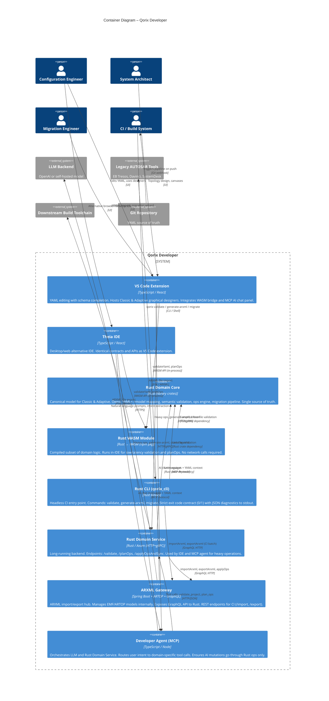

# C2 – Containers: Qorix Developer

## Overview

Zooming into Qorix Developer, the platform is composed of four major container groups: **IDE Clients** (VS Code / Theia), the **Rust Domain Platform** (core + WASM + CLI + service), the **ARXML Gateway** (Spring Boot + ARTOP + GraphQL), and the **AI / MCP Layer** (Qorix Agent + LLM).

---

## Mermaid Diagram

---

## Container Responsibilities

### IDE Clients

| Container | Technology | Responsibility |
|---|---|---|
| VS Code Extension | TypeScript / React | YAML editing, schema completion, Classic & Adaptive graphical designers, WASM bridge, AI chat panel |
| Theia IDE | TypeScript / React | Desktop/web alternative; identical APIs and contracts as VS Code |

- Classic designers: SWC, ComStack, ECU/BSW, OS, NvM, RTE
- Adaptive designers: Application, Communication, Machine, Platform Services, Execution, Deployment
- Fast path → WASM for instant feedback; heavy path → Rust Domain Service

### Rust Domain Platform

| Container | Technology | Responsibility |
|---|---|---|
| Rust Domain Core | Rust (crates) | Canonical model, YAML↔model, validation, ops, migration — single source of truth |
| Rust WASM Module | Rust → WASM npm pkg | In-IDE validation & planOps; no network; compiled subset of core |
| Rust CLI | Rust binary | Headless CI/batch entry point; same domain core as service |
| Rust Domain Service | Rust / Axum HTTP+gRPC | Long-running backend for IDE and MCP; /validate, /planOps, /applyOpsAndSync |

**Key principle:** `rustCore` is a library shared by WASM, CLI, and Service — no parallel implementations.

### ARXML Gateway

| Container | Technology | Responsibility |
|---|---|---|
| ARXML Gateway | Spring Boot + ARTOP + GraphQL | ARXML-only import/export; EMF model management; GraphQL interface to Rust |

- Rust uses only the GraphQL API; it never touches EMF classes directly.
- Import flow: `ARXML → EMF → GraphQL → Rust model → YAML`
- Export flow: `YAML → Rust model → GraphQL mutations → EMF → ARXML`

### AI / MCP Layer

| Container | Technology | Responsibility |
|---|---|---|
| Developer Agent (MCP) | TypeScript / Node | Intent routing, tool registry, safe AI orchestration via Rust ops |
| LLM Backend | External (OpenAI / self-hosted) | Natural language understanding, plan explanations |

---

## Key Architectural Decisions at C2

- **WASM for speed, Rust Service for depth.** Fast & local = WASM; heavy & persistent = Rust service + gateway.
- **CLI as headless pipeline entry point.** Same codebase as IDE, strict exit code contracts for CI.
- **AI is always wrapped in Rust.** The MCP agent never mutates files or EMF directly — all changes are Rust `OperationPlan` instances, validated before apply.
- **Spring Boot / EMF are implementation details.** They sit behind the GraphQL contract and are invisible to all other containers.
