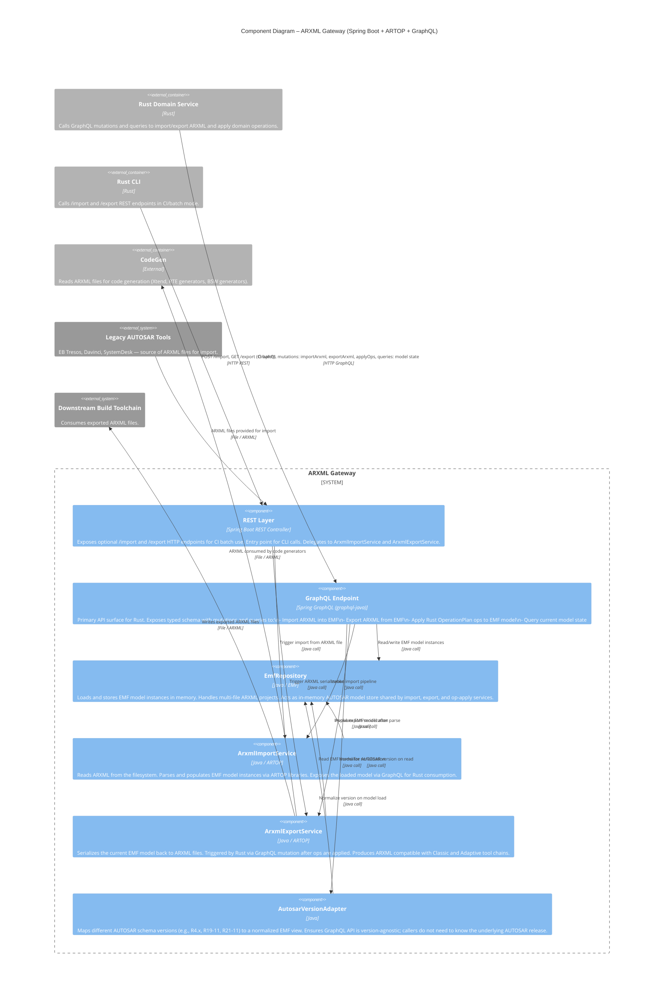

# C3 – Components: ARXML Gateway

## Overview

The ARXML Gateway is a **Spring Boot + ARTOP + GraphQL** container. It is the sole bridge between the Rust domain world and the ARXML/EMF world. Rust components never access EMF classes directly — they communicate exclusively through the GraphQL API exposed by this container.

---

## Mermaid Diagram



---

## Component Descriptions

### REST Layer
- Spring Boot `@RestController` providing optional HTTP endpoints.
- `/import` — accepts an ARXML file path or upload for CI/batch import.
- `/export` — triggers ARXML serialization and returns a file path or stream.
- Used primarily by `qorix_cli` in CI pipelines. The Rust Domain Service uses GraphQL, not REST.

### GraphQL Endpoint
- The **primary API surface** for all Rust consumers.
- Defined by a typed schema; callers issue queries and mutations.
- Key mutations exposed:
  - `importArxml(filePaths: [String!]!)` — load ARXML into EMF
  - `exportArxml(outputPath: String!)` — serialize EMF to ARXML
  - `applyOps(ops: [OperationInput!]!)` — apply Rust-computed ops to EMF model
- Key queries:
  - Read model state, validate consistency

### EmfRepository
- Holds all in-memory EMF `EObject` instances for the current AUTOSAR project.
- Handles multi-file ARXML projects (a single project can span many `.arxml` files).
- Acts as the shared in-memory state between Import, Export, and op-apply logic.
- **Never exposed directly to Rust** — only accessed through GraphQL.

### ArxmlImportService
- Invokes ARTOP's ARXML parser to load `.arxml` files from the filesystem.
- Populates `EmfRepository` with the resulting EMF model tree.
- Normalizes via `AutosarVersionAdapter` on load.
- Called by both the GraphQL endpoint (IDE/interactive) and the REST layer (CI batch).

### ArxmlExportService
- Reads the current EMF model from `EmfRepository`.
- Serializes it back to `.arxml` file(s) using ARTOP's writer APIs.
- Triggered by Rust via a GraphQL `exportArxml` mutation after all ops have been applied.
- Produces ARXML compatible with downstream toolchains and legacy AUTOSAR tools.

### AutosarVersionAdapter
- Abstracts AUTOSAR schema version differences (Classic R4.x series, Adaptive releases).
- Maps version-specific EMF model constructs to a normalized view that the GraphQL schema can express uniformly.
- Ensures the GraphQL API remains stable as AUTOSAR schema versions evolve.

---

## Data Flows

### Import Flow (ARXML → YAML)
```
ARXML files → ArxmlImportService → EmfRepository
EmfRepository → GraphQL Endpoint → Rust Domain Service
Rust Domain Service → Rust model → YAML files
```

### Export Flow (YAML → ARXML)
```
YAML files → Rust Domain Service → Rust model → GraphQL mutations (applyOps)
GraphQL Endpoint → EmfRepository → ArxmlExportService → ARXML files
```

---

## Key Design Constraints

- **Rust never touches EMF.** `core::gql_client` (a generated GraphQL client) is the only bridge. All Rust code that needs ARXML data goes through GraphQL mutations/queries.
- **Spring Boot / EMF are implementation details.** The GraphQL contract is the stable interface; ARTOP and EMF internals can evolve without affecting Rust.
- **Version adapter is the AUTOSAR compatibility layer.** New AUTOSAR schema versions are absorbed here, not propagated into Rust model changes.
- **Classic and Adaptive share this gateway.** Both stacks use the same Spring Boot service; the ARTOP libraries support both Classic and Adaptive ARXML.
