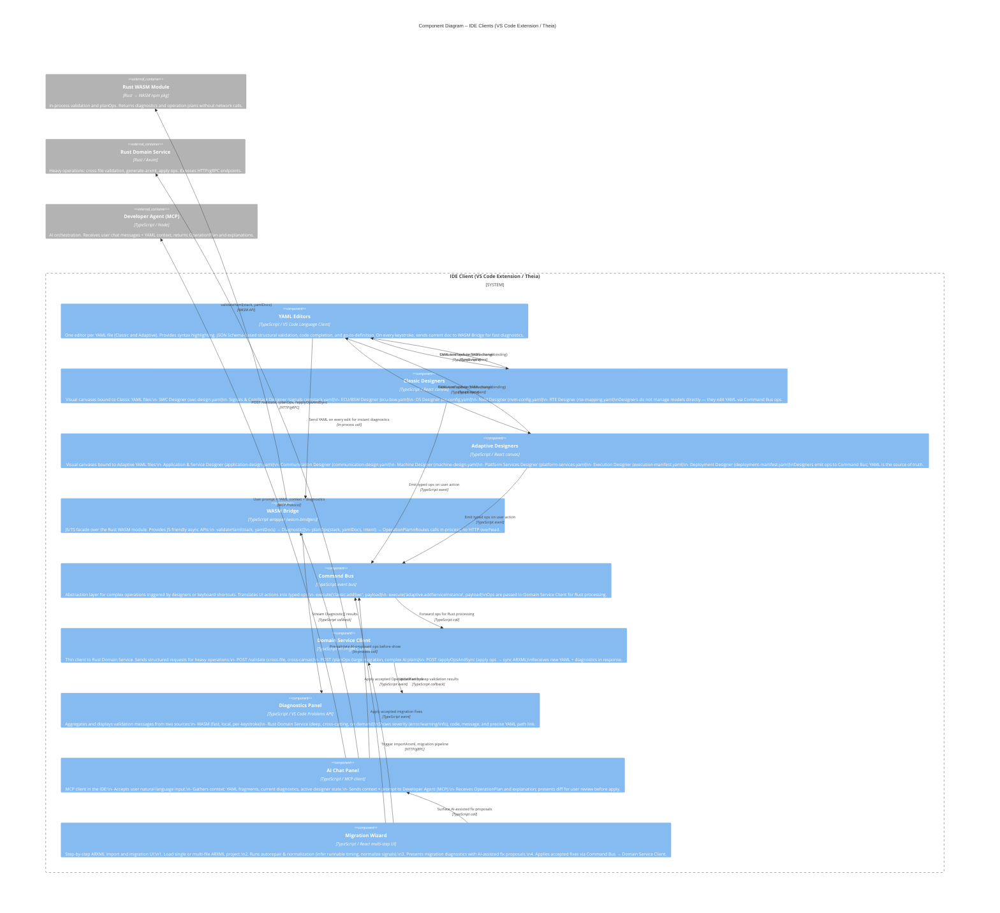

# C3 – Components: IDE Clients (VS Code Extension + Theia)

## Overview

The IDE client layer (VS Code Extension and Theia IDE) provides all user-facing interaction surfaces: YAML editing, graphical designers, diagnostics, AI chat, and migration wizard. Both IDEs share identical internal component contracts — they differ only in their host shell (VS Code vs Theia/browser). The component architecture follows a clear two-path model: **fast & local via WASM** for instant feedback, **heavy & persistent via Rust Domain Service** for cross-cutting operations.

---

## Mermaid Diagram



---

## Component Descriptions

### YAML Editors
- One editor instance per YAML file per stack (Classic: 6 files; Adaptive: 6 files).
- JSON Schema–backed for structural completion and validation (field names, enums, required keys).
- Bidirectional binding with graphical designers: a YAML text edit immediately refreshes the canvas; a canvas drag-drop immediately updates the YAML text.
- Every keystroke sends the current document set to the WASM Bridge for fast diagnostics.

### Classic Designers (6 canvases)
Visual canvases for AUTOSAR Classic configuration:

| Designer | YAML File | Domain |
|---|---|---|
| SWC Designer | `swc-design.yaml` | SWCs, ports, interfaces, runnables |
| Signals & ComStack | `signals-comstack.yaml` | Signals, I-PDUs, PDUs, COM/PduR/CanIf routing |
| ECU / BSW Designer | `ecu-bsw.yaml` | ECUC, BSW modules, MCAL bindings |
| OS Designer | `os-config.yaml` | Tasks, ISRs, alarms, OS events |
| NvM Designer | `nvm-config.yaml` | NvM blocks, memory layout, device assignments |
| RTE Designer | `rte-mapping.yaml` | Runnable-to-task mappings, port connections |

### Adaptive Designers (6 canvases)
Visual canvases for AUTOSAR Adaptive configuration:

| Designer | YAML File | Domain |
|---|---|---|
| Application & Service | `application-design.yaml` | Executables, service interfaces, ports |
| Communication | `communication-design.yaml` | SOME/IP, service discovery, network bindings |
| Machine Designer | `machine-design.yaml` | Machine manifest, hardware resources, OS config |
| Platform Services | `platform-services.yaml` | Logging, time sync, persistency, update manager |
| Execution | `execution-manifest.yaml` | Process definitions, functional groups, startup config |
| Deployment | `deployment-manifest.yaml` | Application-to-machine bindings, service deployment |

### WASM Bridge
- Thin TypeScript/JS wrapper generated by `wasm-bindgen`.
- Provides async-friendly APIs over synchronous WASM calls.
- Runs in-process — zero network overhead, sub-millisecond round-trips.
- Supports both Classic and Adaptive stacks via the `stack` parameter.

### Command Bus
- Central event bus decoupling designers from the domain service client.
- All designer user actions are expressed as typed operation payloads.
- Enables undo/redo, operation logging, and AI plan preview before apply.

### Domain Service Client
- Thin HTTP/gRPC client; no business logic.
- Manages retry, timeout, and error surfacing to the diagnostics panel.
- Handles both the "apply ops" write path and the "validate only" read path.

### Diagnostics Panel
- Merges WASM (fast) and Rust Service (deep) diagnostics into one unified view.
- Maps YAML path references to clickable editor locations.
- Severity: `error` (🔴), `warning` (🟡), `info` (🔵).

### AI Chat Panel
- MCP client: sends a structured context packet (prompt + YAML fragments + diagnostics) to the Developer Agent.
- Receives back an `OperationPlan` (structured diff) and a human-readable explanation.
- Shows the proposed diff for user review; only applies when the user confirms.
- Can optionally pre-validate proposed ops via WASM before presenting.

### Migration Wizard
- Multi-step UI for onboarding existing ARXML projects.
- Step 1: File selection (single or multi-file ARXML).
- Step 2: Autorepair & normalization (infer runnable timing, normalize signals, deduplicate).
- Step 3: Migration diagnostics with AI-assisted fix proposals.
- Step 4: Apply accepted fixes via Command Bus.

---

## Two-Path Architecture

```
Fast & Local (WASM path)
  User edits YAML
  → YAML Editor sends doc to WASM Bridge
  → wasmBridge.validateYaml(stack, docs)
  → Diagnostics Panel updated instantly (no network)

Heavy & Persistent (Rust Service path)
  User triggers generate-arxml / large migration / cross-file validation
  → Designer → Command Bus → Domain Service Client
  → POST /applyOpsAndSync on Rust Domain Service
  → Rust calls ARXML Gateway if ARXML output needed
  → New YAML + diagnostics returned to IDE
```

---

## Key Design Principles

- **Designers never own the model.** They emit YAML ops via the Command Bus; the Rust domain is always the model authority.
- **Bidirectional binding is lossless.** A YAML edit and a canvas drag-drop are equivalent; neither is "more real" than the other.
- **AI is always presented as a diff.** The AI Chat Panel never applies changes silently; every AI-proposed OperationPlan goes through user review.
- **WASM replaces file-save validation.** Feedback is continuous and in-process, not deferred to a build step.
- **Classic and Adaptive share the same IDE shell.** All designers, editors, command bus, and WASM bridge are stack-parameterised; no duplicate implementations.
