# C3 – Components: Rust Domain Platform

## Overview

The Rust Domain Platform is the **single source of truth** for all AUTOSAR semantic logic in Qorix. It is structured as a Rust workspace of library crates (shared `core::*`, domain-specific `classic::*` and `adaptive::*`) plus three build targets (`Rust Domain Service`, `qorix_cli`, `qorix_core_wasm`). All API surfaces — gRPC, REST, WASM, CLI — are thin interface layers on top of this shared crate graph.

---

## Mermaid Diagram

```mermaid
C4Component
    title Component Diagram – Rust Domain Platform

    Container_Ext(vscode, "VS Code Extension / Theia", "TypeScript", "IDE clients calling WASM APIs and HTTP/gRPC service endpoints.")
    Container_Ext(mcpAgent, "Developer Agent (MCP)", "TypeScript / Node", "AI orchestration layer. Calls Rust Domain Service tool endpoints.")
    Container_Ext(ciSystem, "CI / Build System", "Jenkins / GitLab CI / GitHub Actions", "Calls qorix_cli with validate, generate-arxml, migrate commands.")
    Container_Ext(arxmlGw, "ARXML Gateway", "Spring Boot + GraphQL", "Receives GraphQL mutations/queries from core::gql_client.")

    System_Boundary(rustPlatform, "Rust Domain Platform") {

        %% ── Shared Core Crates ──
        Component(coreModel, "core::model", "Rust library crate", "Common primitives shared by all domain crates:\n- Qualified names and IDs\n- Base datatypes (Integer, Float, String, Boolean, Enum)\n- QoS enums and signal datatypes (shared Classic/Adaptive)\n- Unified error types and diagnostic types\nBase types for Classic and Adaptive model structs.")

        Component(coreYaml, "core::yaml", "Rust library crate (serde)", "serde-based bidirectional mapping between YAML text and Rust structs.\n- Supports partial/incomplete YAML (editing in progress)\n- Builds full typed model from raw structs\n- Serializes Rust model back to YAML\n- Used by all domain model crates for persistence")

        Component(coreValidation, "core::validation", "Rust library crate", "Generic rule engine and diagnostics framework.\nEach rule produces a Diagnostic with:\n- Severity: error / warning / info\n- Code: machine-readable rule identifier\n- Message: human-readable explanation\n- Path: precise YAML path for IDE navigation\nUsed by classic::validation and adaptive::validation.")

        Component(coreOps, "core::ops", "Rust library crate", "Operation model used by all layers:\n- Low-level ops: add / update / delete at YAML path\n- High-level domain ops: named transformations\n- OperationPlan: ordered list of ops with metadata\nThe ops format is the shared contract between IDE, MCP, and CLI.")

        Component(coreGqlClient, "core::gql_client", "Rust library crate (generated)", "Generated GraphQL client from the ARXML Gateway schema.\n- importArxml mutation\n- exportArxml mutation\n- applyOps mutation\n- Model query operations\nRust's only bridge to ARXML/EMF. Never touches EMF directly.")

        Component(coreMigration, "core::migration", "Rust library crate", "Generic migration pipeline engine:\n- Pipeline steps: parse → normalize → auto-fix → report\n- Step result types: success, warning, skipped, failed\n- Progress tracking and structured migration reports\nUsed by classic::migration and adaptive::migration as the framework.")

        %% ── Classic Domain Crates ──
        Component(classicModel, "classic::model", "Rust library crate", "AUTOSAR Classic AUTOSAR entities as strongly-typed Rust structs:\n- SWCs, ports (R/P/C/S), interfaces, runnables, inter-runnable variables\n- ComStack: signals, I-PDUs, PDUs, COM/PduR routing, CanIf channels\n- ECUC: BSW module configurations, MCAL bindings (Port, Dio, Adc, ...)\n- OS: tasks, ISRs, alarms, events, OS applications\n- NvM: blocks, memory layout, device capacity constraints\n- RTE: runnable-to-task mappings, port trigger configurations\nExtends core::model base types.")

        Component(classicValidation, "classic::validation", "Rust library crate", "Classic-specific validation rules using core::validation engine:\n- Every runnable is mapped to exactly one OS task\n- Signal-to-I-PDU binding completeness\n- PDU routing path continuity (COM → PduR → CanIf)\n- NvM block layout fits within device capacity\n- OS task and alarm timing consistency\n- BSW module dependency checks\nProduces Diagnostic[] with YAML paths for IDE display.")

        Component(classicOps, "classic::ops", "Rust library crate", "Higher-level Classic domain operations:\n- map_runnable_to_task(runnable_id, task_id)\n- create_ipdu(name, signals[])\n- assign_signal_to_ipdu(signal_id, ipdu_id)\n- configure_pdu_routing(ipdu_id, canif_channel)\n- add_nvm_block(name, size, device)\n- generate_rte_mapping(swc_id)\nAll ops are expressed as core::ops OperationPlan entries.")

        Component(classicMigration, "classic::migration", "Rust library crate", "ARXML ↔ YAML migration for Classic:\n- ARXML → EMF (via GraphQL) → Rust classic model → YAML\n- YAML → Rust classic model → GraphQL mutations → EMF → ARXML\n- Autorepair: infer runnable timing from OS alarms, normalize signal names\n- Migration paths from: EB Tresos, Vector Davinci, dSPACE SystemDesk\nUses core::migration pipeline and core::gql_client.")

        %% ── Adaptive Domain Crates ──
        Component(adaptiveModel, "adaptive::model", "Rust library crate", "AUTOSAR Adaptive AUTOSAR entities as strongly-typed Rust structs:\n- Applications, executables, service interfaces (SOME/IP, IPC)\n- Machine manifest: hardware resources, OS config, network interfaces\n- Execution manifest: process definitions, functional groups, startup\n- Service instance deployment: provider/consumer bindings, transport config\n- Platform services: logging (DLT), time sync (StbM), persistency (KVS), update manager\nExtends core::model base types.")

        Component(adaptiveValidation, "adaptive::validation", "Rust library crate", "Adaptive-specific validation rules:\n- Every service consumer has a matching provider binding\n- QoS and transport binding completeness\n- Machine resource constraints (CPU affinity, memory limits)\n- Functional group lifecycle consistency\n- IPC channel permission checks\n- Platform service configuration completeness\nProduces Diagnostic[] with YAML paths.")

        Component(adaptiveOps, "adaptive::ops", "Rust library crate", "Higher-level Adaptive domain operations:\n- add_service_instance(app_id, interface_id, role: provider|consumer)\n- bind_consumer_to_provider(consumer_id, provider_id, transport)\n- map_app_to_machine(app_id, machine_id)\n- configure_execution_manifest(app_id, startup_config)\n- add_platform_service(machine_id, service_type)\nAll ops expressed as core::ops OperationPlan entries.")

        Component(adaptiveMigration, "adaptive::migration", "Rust library crate", "ARXML ↔ YAML migration for Adaptive:\n- Adaptive ARXML → EMF → Rust adaptive model → YAML\n- YAML → Rust adaptive model → GraphQL mutations → EMF → Adaptive ARXML\n- Autorepair: normalize service interface names, infer missing manifest entries\nUses core::migration pipeline and core::gql_client.")

        %% ── Build Targets ──
        Component(rustDomainSvc, "Rust Domain Service", "Rust binary (Axum HTTP + tonic gRPC)", "Long-running backend process. Links against all core::* and domain crates.\nExposes:\n- POST /validate → runs classic or adaptive validation\n- POST /planOps → computes OperationPlan from YAML + intent\n- POST /applyOpsAndSync → applies ops, calls ARXML Gateway if needed\n- gRPC equivalents for all above\nUsed by IDE (heavy path) and MCP Agent.")

        Component(qorixCli, "qorix_cli", "Rust binary", "Headless CI/batch entry point. Links against all core::* and domain crates.\nCommands:\n- qorix validate --stack classic|adaptive --project <path>\n- qorix generate-arxml --stack classic|adaptive --project <path>\n- qorix migrate --from-arxml <path> --stack classic|adaptive\nExit codes: 0 = success, 1 = failure. JSON diagnostics to stdout.")

        Component(qorixCoreWasm, "qorix_core_wasm", "Rust → WASM (wasm-pack npm pkg)", "Compiled subset of core + domain crates for in-IDE use.\nExposes via wasm-bindgen:\n- validateYaml(stack: string, docs: YamlDocSet) → Diagnostic[]\n- planOps(stack: string, docs: YamlDocSet, intent: string) → OperationPlan\nNo network calls. Runs synchronously in VS Code / Theia process.")
    }

    %% External → Build Targets
    Rel(vscode, qorixCoreWasm, "validateYaml, planOps (fast in-process path)", "WASM API")
    Rel(vscode, rustDomainSvc, "POST /validate, /planOps, /applyOpsAndSync", "HTTP/gRPC")
    Rel(mcpAgent, rustDomainSvc, "Tool calls: validate_project, plan_ops, fix_*", "HTTP/JSON")
    Rel(ciSystem, qorixCli, "qorix validate / generate-arxml / migrate", "CLI / Shell")

    %% Build Targets → Core crates
    Rel(rustDomainSvc, coreModel, "Uses base types", "Rust crate dep")
    Rel(rustDomainSvc, coreYaml, "YAML serialization", "Rust crate dep")
    Rel(rustDomainSvc, coreValidation, "Runs validation pipeline", "Rust crate dep")
    Rel(rustDomainSvc, coreOps, "Builds OperationPlan", "Rust crate dep")
    Rel(rustDomainSvc, coreMigration, "Runs migration pipeline", "Rust crate dep")
    Rel(rustDomainSvc, coreGqlClient, "Calls ARXML Gateway", "Rust crate dep")

    Rel(qorixCli, coreModel, "Uses base types", "Rust crate dep")
    Rel(qorixCli, coreYaml, "YAML serialization", "Rust crate dep")
    Rel(qorixCli, coreValidation, "Runs validation", "Rust crate dep")
    Rel(qorixCli, coreOps, "Applies ops", "Rust crate dep")
    Rel(qorixCli, coreMigration, "Runs migration", "Rust crate dep")
    Rel(qorixCli, coreGqlClient, "Calls ARXML Gateway for ARXML gen", "Rust crate dep")

    Rel(qorixCoreWasm, coreModel, "Uses base types (WASM subset)", "Rust crate dep")
    Rel(qorixCoreWasm, coreYaml, "YAML parsing (WASM subset)", "Rust crate dep")
    Rel(qorixCoreWasm, coreValidation, "Validation rules (WASM subset)", "Rust crate dep")
    Rel(qorixCoreWasm, coreOps, "planOps (WASM subset)", "Rust crate dep")

    %% Domain crates → core crates
    Rel(classicModel, coreModel, "Extends base types", "Rust crate dep")
    Rel(classicModel, coreYaml, "YAML serde mapping", "Rust crate dep")
    Rel(classicValidation, coreValidation, "Uses rule engine + diagnostics", "Rust crate dep")
    Rel(classicValidation, classicModel, "Validates classic model", "Rust crate dep")
    Rel(classicOps, coreOps, "Builds OperationPlan entries", "Rust crate dep")
    Rel(classicOps, classicModel, "Operates on classic model", "Rust crate dep")
    Rel(classicMigration, coreMigration, "Uses migration pipeline", "Rust crate dep")
    Rel(classicMigration, coreGqlClient, "Calls ARXML Gateway", "Rust crate dep")
    Rel(classicMigration, classicModel, "Converts to/from classic model", "Rust crate dep")

    Rel(adaptiveModel, coreModel, "Extends base types", "Rust crate dep")
    Rel(adaptiveModel, coreYaml, "YAML serde mapping", "Rust crate dep")
    Rel(adaptiveValidation, coreValidation, "Uses rule engine + diagnostics", "Rust crate dep")
    Rel(adaptiveValidation, adaptiveModel, "Validates adaptive model", "Rust crate dep")
    Rel(adaptiveOps, coreOps, "Builds OperationPlan entries", "Rust crate dep")
    Rel(adaptiveOps, adaptiveModel, "Operates on adaptive model", "Rust crate dep")
    Rel(adaptiveMigration, coreMigration, "Uses migration pipeline", "Rust crate dep")
    Rel(adaptiveMigration, coreGqlClient, "Calls ARXML Gateway", "Rust crate dep")
    Rel(adaptiveMigration, adaptiveModel, "Converts to/from adaptive model", "Rust crate dep")

    %% gql_client → external
    Rel(coreGqlClient, arxmlGw, "GraphQL mutations: importArxml, exportArxml, applyOps", "HTTP GraphQL")

    %% Build targets link to domain crates
    Rel(rustDomainSvc, classicModel, "Links", "Rust crate dep")
    Rel(rustDomainSvc, classicValidation, "Links", "Rust crate dep")
    Rel(rustDomainSvc, classicOps, "Links", "Rust crate dep")
    Rel(rustDomainSvc, classicMigration, "Links", "Rust crate dep")
    Rel(rustDomainSvc, adaptiveModel, "Links", "Rust crate dep")
    Rel(rustDomainSvc, adaptiveValidation, "Links", "Rust crate dep")
    Rel(rustDomainSvc, adaptiveOps, "Links", "Rust crate dep")
    Rel(rustDomainSvc, adaptiveMigration, "Links", "Rust crate dep")

    Rel(qorixCli, classicModel, "Links", "Rust crate dep")
    Rel(qorixCli, classicValidation, "Links", "Rust crate dep")
    Rel(qorixCli, classicOps, "Links", "Rust crate dep")
    Rel(qorixCli, classicMigration, "Links", "Rust crate dep")
    Rel(qorixCli, adaptiveModel, "Links", "Rust crate dep")
    Rel(qorixCli, adaptiveValidation, "Links", "Rust crate dep")
    Rel(qorixCli, adaptiveOps, "Links", "Rust crate dep")
    Rel(qorixCli, adaptiveMigration, "Links", "Rust crate dep")

    Rel(qorixCoreWasm, classicModel, "Links (WASM subset)", "Rust crate dep")
    Rel(qorixCoreWasm, classicValidation, "Links (WASM subset)", "Rust crate dep")
    Rel(qorixCoreWasm, classicOps, "Links (WASM subset)", "Rust crate dep")
    Rel(qorixCoreWasm, adaptiveModel, "Links (WASM subset)", "Rust crate dep")
    Rel(qorixCoreWasm, adaptiveValidation, "Links (WASM subset)", "Rust crate dep")
    Rel(qorixCoreWasm, adaptiveOps, "Links (WASM subset)", "Rust crate dep")
```

---

## Crate Reference

### Shared Core Crates

| Crate | Purpose |
|---|---|
| `core::model` | Base types: IDs, qualified names, datatypes, shared enums, error types |
| `core::yaml` | serde bidirectional YAML ↔ Rust struct mapping; supports partial data |
| `core::validation` | Generic rule engine; produces `Diagnostic` with severity, code, message, YAML path |
| `core::ops` | `OperationPlan` model; low-level and high-level op types |
| `core::gql_client` | Generated GraphQL client for ARXML Gateway |
| `core::migration` | Pipeline engine: steps, progress, reports |

### Classic Domain Crates

| Crate | Covers |
|---|---|
| `classic::model` | SWCs, ComStack, ECUC/BSW, OS, NvM, RTE — all as Rust structs |
| `classic::validation` | Runnable mapping, signal binding, PDU routing, NvM capacity, OS timing |
| `classic::ops` | `map_runnable_to_task`, `create_ipdu`, `assign_signal_to_ipdu`, etc. |
| `classic::migration` | ARXML ↔ YAML; Tresos/Davinci/SystemDesk import paths; autorepair |

### Adaptive Domain Crates

| Crate | Covers |
|---|---|
| `adaptive::model` | Applications, machine manifest, execution manifest, platform services |
| `adaptive::validation` | Service bindings, QoS transport, machine resource constraints |
| `adaptive::ops` | `add_service_instance`, `bind_consumer_to_provider`, `map_app_to_machine`, etc. |
| `adaptive::migration` | Adaptive ARXML ↔ YAML; autorepair for manifests |

### Build Targets

| Target | Type | Users |
|---|---|---|
| `Rust Domain Service` | Rust binary (Axum + tonic) | IDE heavy path, MCP Agent |
| `qorix_cli` | Rust binary | CI / Build System |
| `qorix_core_wasm` | WASM npm package | IDE fast path (in-process) |

---

## Key Design Principles

- **One source of truth.** All domain logic lives in `core::*`, `classic::*`, `adaptive::*` crates. The three build targets are interface facades — no business logic lives in them.
- **WASM is a compiled subset.** `qorix_core_wasm` omits `core::gql_client` and network-dependent paths. It only exposes `validateYaml` and `planOps`.
- **CLI and Service are identical in semantics.** Both link the same crates; the CLI is the Service without the HTTP server wrapper. CI results match interactive IDE results exactly.
- **Ops are the universal mutation language.** Every change — from a designer drag-drop to an AI suggestion — is expressed as an `OperationPlan` of `core::ops` entries. There is no other mutation path.
- **Classic and Adaptive are parallel, not tangled.** They share `core::*` but their model, validation, ops, and migration crates are fully separate. Each can evolve independently as long as they respect the `core::*` API and the `core::ops` format.
