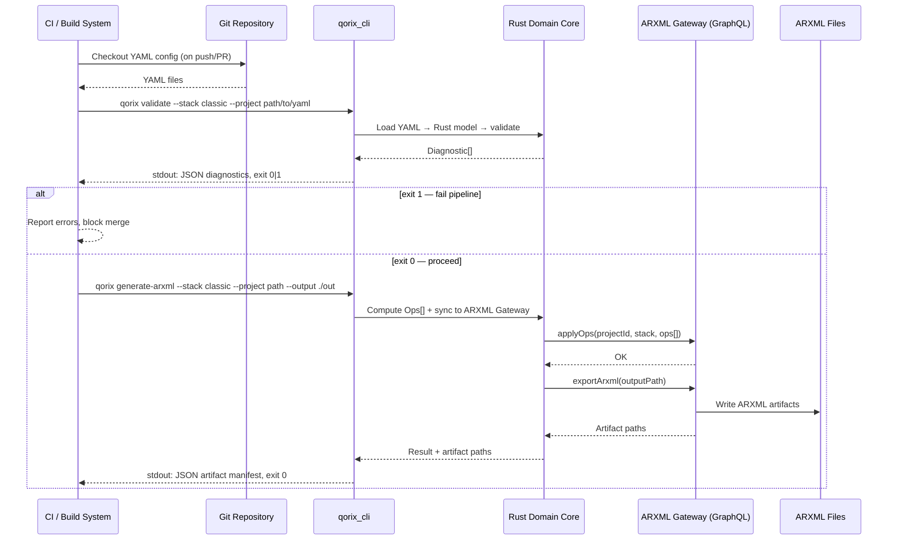

# iface-cli-ci — CLI ↔ CI/Build System Interface

## Purpose

This document specifies the interface contract between the **CI/Build System** (Jenkins, GitLab CI, GitHub Actions, OEM DevOps pipelines) and the **Qorix CLI** (`qorix_cli` binary). The CLI is the sole entry point for all CI-driven Qorix operations — validation, ARXML generation, and migration. No IDE or MCP agent is involved in CI flows.

---

## Interface Overview

```
CI / Build System
       │
       │  shell invocation
       ▼
  qorix_cli  (Rust binary)
       │
       ├──► Rust Domain Core  (validation, ops, migration — in-process)
       │
       └──► ARXML Gateway  (GraphQL — only when ARXML output is needed)
```

**Key principle:** CLI uses CI, not IDE or MCP. The same Rust domain core that runs interactively in the IDE runs headless here — results are bit-for-bit identical.

---

## Commands

### `qorix validate`

Validates all YAML files for a given stack against the Rust domain model and validation rules.

```
qorix validate \
  --stack   classic | adaptive \
  --project <path/to/yaml/dir>  \
  [--report <output/report.json>]
```

| Flag | Required | Description |
|---|---|---|
| `--stack` | Yes | Target AUTOSAR stack: `classic` or `adaptive` |
| `--project` | Yes | Path to directory containing the YAML configuration files |
| `--report` | No | If provided, writes a full JSON diagnostic report to this path |

**Behaviour:**
- Loads all YAML files in the project directory.
- Runs `core::yaml` parsing → `classic::validation` or `adaptive::validation` rule engine.
- Streams human-readable diagnostics to stderr.
- Writes JSON diagnostic array to stdout (see Output Schema).
- Exits `0` on success (no errors), `1` on any validation error.

---

### `qorix generate-arxml`

Validates YAML and, if valid, generates ARXML output via the ARXML Gateway.

```
qorix generate-arxml \
  --stack   classic | adaptive \
  --project <path/to/yaml/dir>  \
  --output  <path/to/arxml/out> \
  [--gateway-url <http://host:port>]
```

| Flag | Required | Description |
|---|---|---|
| `--stack` | Yes | Target AUTOSAR stack |
| `--project` | Yes | Path to YAML project directory |
| `--output` | Yes | Directory where ARXML files will be written |
| `--gateway-url` | No | ARXML Gateway base URL; defaults to `http://localhost:8080` |

**Behaviour:**
- Runs full validation first; aborts with exit `1` if errors exist.
- Calls `core::gql_client` to invoke ARXML Gateway `exportArxml` mutation.
- ARXML Gateway (Spring Boot + ARTOP) writes ARXML files to `--output`.
- Reports artifact paths + status to stdout as JSON.
- Exits `0` on success, `1` on any error.

---

### `qorix migrate`

Imports an existing ARXML project, runs autorepair/normalization, and produces YAML output.

```
qorix migrate \
  --from-arxml <path/to/arxml/dir> \
  --stack      classic | adaptive  \
  --output     <path/to/yaml/out>  \
  [--gateway-url <http://host:port>] \
  [--report    <output/migration-report.json>]
```

| Flag | Required | Description |
|---|---|---|
| `--from-arxml` | Yes | Path to input ARXML files (single or multi-file project) |
| `--stack` | Yes | Target AUTOSAR stack |
| `--output` | Yes | Directory where generated YAML files will be written |
| `--gateway-url` | No | ARXML Gateway base URL; defaults to `http://localhost:8080` |
| `--report` | No | If provided, writes structured migration report JSON to this path |

**Behaviour:**
- Calls ARXML Gateway `importArxml` mutation to load ARXML into EMF.
- Runs `classic::migration` or `adaptive::migration` pipeline (parse → normalize → autorepair → report).
- Writes YAML files to `--output`.
- Reports migration step results (success / warning / failed) to stdout as JSON.
- Exits `0` on success, `1` if any fatal migration step fails.

---

## Exit Code Contract

| Exit Code | Meaning |
|---|---|
| `0` | All checks passed; output artifacts written successfully |
| `1` | One or more errors; no output artifacts should be trusted |

**Rules:**
- Exit code `0` means CI can proceed to downstream stages (e.g., build toolchain, deploy).
- Exit code `1` must fail the CI stage. The JSON diagnostics on stdout provide structured failure details for CI reporting.
- There is no exit code `2` or other variants — the contract is strictly binary.

---

## Stdout / Stderr Contract

| Stream | Content |
|---|---|
| `stdout` | **Machine-readable JSON** — diagnostic array, artifact paths, or migration report. Always valid JSON on successful command execution. |
| `stderr` | **Human-readable** log lines — progress messages, warnings, debug info. CI systems may capture but should not parse stderr. |

**CI pipeline integration pattern:**
```bash
# Validate and capture diagnostics
OUTPUT=$(qorix validate --stack classic --project ./config)
EXIT=$?

if [ $EXIT -ne 0 ]; then
  echo "$OUTPUT" | jq '.diagnostics[] | select(.severity == "error")'
  exit 1
fi
```

---

## Stdout JSON Schema

### Diagnostic (from `validate` and `generate-arxml`)

```json
{
  "diagnostics": [
    {
      "severity": "error" | "warning" | "info",
      "code": "CLASSIC-VAL-001",
      "message": "Runnable 'MyRunnable' is not mapped to any OS task",
      "file": "swc-design.yaml",
      "path": "swcs[0].runnables[1].name",
      "line": 42
    }
  ],
  "summary": {
    "errors": 1,
    "warnings": 3,
    "infos": 0
  }
}
```

### Artifact Result (from `generate-arxml`)

```json
{
  "diagnostics": [],
  "summary": { "errors": 0, "warnings": 0, "infos": 0 },
  "artifacts": [
    { "type": "arxml", "path": "./out/ecu-extract.arxml" },
    { "type": "arxml", "path": "./out/system-extract.arxml" }
  ],
  "status": "success"
}
```

### Migration Report (from `migrate`)

```json
{
  "steps": [
    { "name": "parse",      "status": "success", "detail": "Loaded 3 ARXML files" },
    { "name": "normalize",  "status": "success", "detail": "Normalized 14 signal names" },
    { "name": "autorepair", "status": "warning",  "detail": "Inferred timing for 2 runnables" },
    { "name": "report",     "status": "success", "detail": "" }
  ],
  "output_files": [
    "swc-design.yaml",
    "signals-comstack.yaml",
    "os-config.yaml"
  ],
  "diagnostics": [],
  "status": "success"
}
```

---

## CI Sequence Flow



---

## Versioning & Compatibility

- CLI binary version must match the Rust domain core version — they are built together from the same workspace.
- The JSON stdout schema is **additive-only**; new fields may be added in minor versions. CI scripts must not fail on unknown fields.
- Breaking CLI flag changes require a semver major bump and a migration guide.
- The `--gateway-url` flag allows CI pipelines to point at a test or staging ARXML Gateway instance, decoupling CLI testing from production gateway.

---

## CI Integration Examples

### GitLab CI

```yaml
validate:
  stage: test
  script:
    - qorix validate --stack classic --project ./config --report report.json
  artifacts:
    reports:
      junit: report.json
    when: always

generate-arxml:
  stage: build
  needs: [validate]
  script:
    - qorix generate-arxml --stack classic --project ./config --output ./arxml-out
  artifacts:
    paths:
      - arxml-out/
```

### GitHub Actions

```yaml
- name: Validate YAML
  run: qorix validate --stack adaptive --project ./config
  
- name: Generate ARXML
  if: success()
  run: qorix generate-arxml --stack adaptive --project ./config --output ./dist
```

---

## Key Design Constraints

- **CLI is stateless.** Each invocation is fully independent. No daemon, no persisted state between runs.
- **No side effects on `validate`.** The validate command never writes YAML, ARXML, or any files; it is a pure read + report operation.
- **ARXML Gateway is optional for validation.** The `validate` command does not require the gateway to be running. Only `generate-arxml` and `migrate` call the gateway.
- **Same code path as IDE.** There are no CLI-specific validation rules. CI failures and interactive IDE errors are produced by the same Rust crates.
