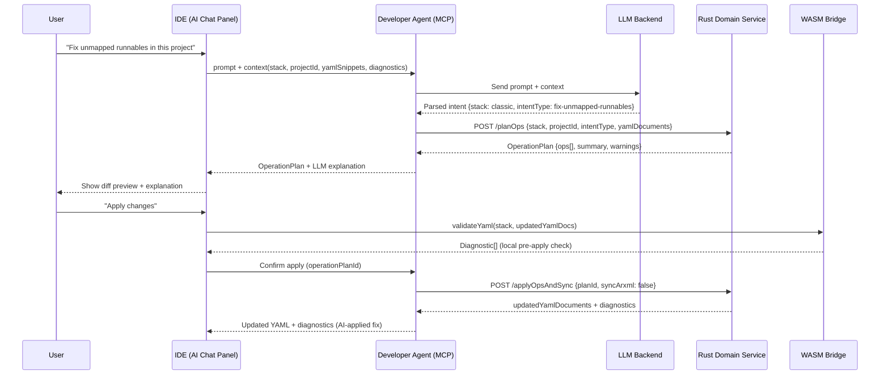

# iface-mcp-rust — MCP Agent ↔ Rust Domain Service Interface

## Purpose

This document specifies the interface contract between the **Developer Agent (MCP)** and the **Rust Domain Service**. The MCP agent is the AI orchestration layer; it translates natural language user intent into structured tool calls against Rust. Rust produces deterministic `OperationPlan` outputs; the LLM never touches YAML or ARXML directly.

---

## Interface Overview

```
IDE AI Chat Panel
       │
       │  MCP protocol
       ▼
Developer Agent (MCP)
       │
       ├── Intent Router  ──► LLM Backend  (natural language → intent)
       │
       ├── Tool Registry
       │
       ├── Shared Tools ──┐
       ├── Classic Tools ──┤──► POST /planOps, /validate  ──► Rust Domain Service
       └── Adaptive Tools ─┘                                        │
                                                              OperationPlan
                                                              + Diagnostic[]
```

**Key invariant:** The LLM never edits YAML or calls ARXML directly. All mutations are expressed as `OperationPlan` entries computed by Rust and presented as a diff for user review before apply.

---

## Transport

| Attribute | Value |
|---|---|
| Protocol | HTTP/JSON (primary); gRPC (alternative, same semantics) |
| Base URL | `http://rust-domain-service:3000` (configurable) |
| Content-Type | `application/json` |
| Auth | Internal service; mTLS or token in secure deployments |

---

## Endpoints Called by MCP Agent

### `POST /validate`

Runs full domain validation for the given project and stack.

**Request:**
```json
{
  "stack": "classic" | "adaptive",
  "project_id": "string",
  "yaml_documents": {
    "swc-design.yaml": "...",
    "signals-comstack.yaml": "...",
    "os-config.yaml": "..."
  }
}
```

**Response:**
```json
{
  "diagnostics": [
    {
      "severity": "error" | "warning" | "info",
      "code": "CLASSIC-VAL-001",
      "message": "Runnable 'MyRunnable' is not mapped to any OS task",
      "file": "swc-design.yaml",
      "path": "swcs[0].runnables[1].name"
    }
  ],
  "summary": {
    "errors": 1,
    "warnings": 0,
    "infos": 2
  }
}
```

---

### `POST /planOps`

Given YAML documents, stack, and an intent string, computes a structured `OperationPlan` describing the changes needed to fulfil the intent.

**Request:**
```json
{
  "stack": "classic" | "adaptive",
  "project_id": "string",
  "intent_type": "fix-unmapped-runnables" | "rebalance-tasks" | "propose-deployment"
                 | "fix-comstack-errors" | "fix-missing-service-bindings"
                 | "suggest-execution-mapping" | "resolve-machine-resource-issues"
                 | "suggest-nvm-layout" | "suggest-runnable-mappings"
                 | "fix-unmapped-signals" | "suggest-service-bindings",
  "yaml_documents": {
    "<filename>": "<yaml content>"
  }
}
```

**Response:**
```json
{
  "operation_plan": {
    "id": "plan-abc123",
    "ops": [
      {
        "kind": "update",
        "file": "os-config.yaml",
        "path": "tasks[0].runnables",
        "value": ["MyRunnable", "OtherRunnable"]
      },
      {
        "kind": "add",
        "file": "swc-design.yaml",
        "path": "swcs[1].runnables",
        "value": { "name": "NewRunnable", "period_ms": 10 }
      }
    ],
    "summary": "Mapped 2 unmapped runnables to Task_10ms",
    "warnings": [
      "Task_10ms is now at 78% CPU budget — monitor load"
    ]
  },
  "diagnostics": []
}
```

---

### `POST /applyOpsAndSync`

Applies an approved `OperationPlan` to the in-memory model, writes updated YAML, and optionally syncs to ARXML Gateway.

**Request:**
```json
{
  "stack": "classic" | "adaptive",
  "project_id": "string",
  "operation_plan_id": "plan-abc123",
  "sync_arxml": false
}
```

**Response:**
```json
{
  "updated_yaml_documents": {
    "os-config.yaml": "...",
    "swc-design.yaml": "..."
  },
  "diagnostics": [],
  "arxml_artifacts": []
}
```

---

## MCP Tool Registry

The MCP agent exposes these tools to the IDE's AI chat. Each tool maps to one or more Rust Domain Service calls.

### Shared Tools (stack-agnostic)

| Tool | Rust Endpoint | Description |
|---|---|---|
| `validate_project(stack, projectId)` | `POST /validate` | Run full validation; return structured diagnostics |
| `summarize_diagnostics(stack, projectId)` | `POST /validate` | Return a human-readable summary for LLM context |

### Classic Tools

| Tool | `intent_type` in `/planOps` | Description |
|---|---|---|
| `fix_unmapped_runnables` | `fix-unmapped-runnables` | Map all runnables without OS task assignments |
| `fix_comstack_errors` | `fix-comstack-errors` | Resolve signal→I-PDU and PDU routing gaps |
| `suggest_runnable_mappings` | `suggest-runnable-mappings` | Propose balanced task assignments for runnables |
| `fix_unmapped_signals` | `fix-unmapped-signals` | Bind signals not yet assigned to I-PDUs |
| `suggest_nvm_layout` | `suggest-nvm-layout` | Propose NvM block layout respecting device capacity |

### Adaptive Tools

| Tool | `intent_type` in `/planOps` | Description |
|---|---|---|
| `fix_missing_service_bindings` | `fix-missing-service-bindings` | Connect service consumers to matching providers |
| `suggest_execution_mapping` | `suggest-execution-mapping` | Map applications to machines with resource fit |
| `resolve_machine_resource_issues` | `resolve-machine-resource-issues` | Fix CPU affinity / memory constraint violations |
| `suggest_service_bindings` | `suggest-service-bindings` | Propose SOME/IP or IPC bindings for unbound services |

---

## Intent Router Logic

The MCP Intent Router classifies a user's natural language message before calling `/planOps`:

```
User message
     │
     ▼
LLM Backend  ──► Parsed intent:
                  {
                    stack: "classic" | "adaptive" | "both",
                    intentType: "<one of the registered types above>"
                  }
     │
     ▼
Tool Registry  ──► Select matching tool
     │
     ▼
POST /planOps on Rust Domain Service
```

**Example routing:**

| User message | Parsed stack | Parsed intentType |
|---|---|---|
| "Fix the unmapped runnables" | `classic` | `fix-unmapped-runnables` |
| "Balance tasks across cores" | `classic` | `rebalance-tasks` |
| "Map radar app to HPC1" | `adaptive` | `suggest-execution-mapping` |
| "Fix missing SOME/IP bindings" | `adaptive` | `fix-missing-service-bindings` |

---

## AI-Assisted Fix Sequence



---

## Safety Invariants

| Invariant | Enforcement |
|---|---|
| LLM never writes YAML | All mutations go through `OperationPlan` from Rust |
| LLM never calls ARXML Gateway | MCP agent calls Rust; Rust calls gateway if needed |
| Every plan is user-approved | IDE shows diff preview; apply requires explicit user confirmation |
| WASM re-validates post-apply | After ops are applied, WASM runs `validateYaml` locally to catch regressions |
| Ops are deterministic | Same YAML + same intentType → same OperationPlan (Rust logic, not LLM) |

---

## Error Handling

| Scenario | MCP Behaviour |
|---|---|
| Rust Domain Service unreachable | Return error to IDE: "Service unavailable — please retry" |
| `/planOps` returns empty ops[] | Inform user: "No changes needed for this intent" |
| `/planOps` returns validation errors | Surface diagnostics to user; do not proceed to diff |
| LLM returns unrecognised intent | Fall back to `validate_project` and surface diagnostics |
| User rejects diff | Discard plan; no state written |

---

## Key Design Constraints

- **MCP is stateless per request.** Each tool call is self-contained; project state lives in Rust Domain Service, not MCP agent.
- **Tool calls are idempotent for planning.** Calling `/planOps` multiple times with the same inputs returns the same plan — it does not mutate state.
- **YAML documents are the context window.** MCP passes the full relevant YAML document set in each call; there is no implicit session state in Rust for AI calls.
- **The ops format is the stable API surface.** The `OperationPlan` JSON schema is versioned; MCP and Rust must agree on the same schema version.
