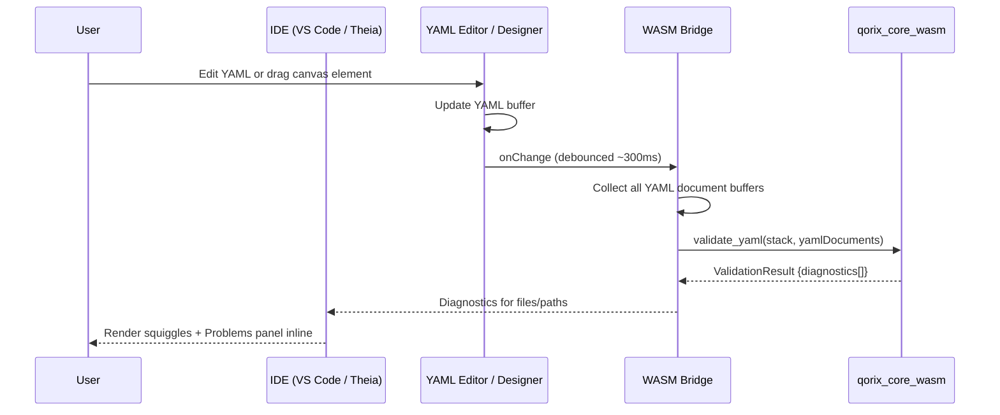
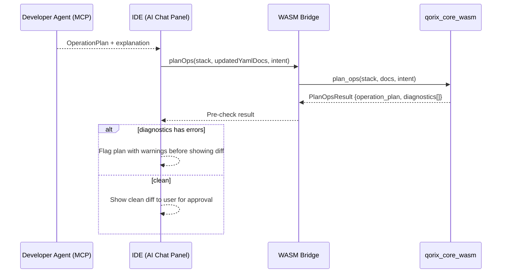

# iface-wasm-ide — Rust WASM Module ↔ IDE Interface

## Purpose

This document specifies the interface contract between the **Rust WASM Module** (`qorix_core_wasm`) and the **IDE clients** (VS Code Extension / Theia) via the **WASM Bridge** TypeScript component. This interface enables in-process, zero-network-call validation and op planning directly inside the editor, providing sub-100ms feedback on every YAML keystroke.

---

## Interface Overview

```
IDE (VS Code / Theia)
       │
       │  TypeScript call (in-process)
       ▼
WASM Bridge (TS wrapper, wasm-bindgen)
       │
       │  WASM function call (synchronous, sandboxed)
       ▼
qorix_core_wasm  (Rust compiled to WebAssembly)
       │
       ├── core::model        (base types)
       ├── core::yaml         (YAML parsing, serde)
       ├── core::validation   (rule engine + diagnostics)
       ├── core::ops          (op planning)
       ├── classic::model     (Classic AUTOSAR model)
       ├── classic::validation
       ├── classic::ops
       ├── adaptive::model    (Adaptive AUTOSAR model)
       ├── adaptive::validation
       └── adaptive::ops
```

**Key invariants:**
- Zero network calls. All logic runs in the WASM sandbox inside the IDE process.
- `core::gql_client` and `core::migration` are **excluded** from the WASM build — they require network and are handled by the Rust Domain Service.
- The WASM module accepts raw YAML text and returns typed results — no shared memory, no file IO.

---

## WASM Exports (via `wasm-bindgen`)

### `validate_yaml`

```typescript
// TypeScript signature (as exposed by wasm-bindgen)
function validate_yaml(
  stack:         "classic" | "adaptive",
  yaml_documents: YamlDocumentSet
): ValidationResult
```

**Purpose:** Run full domain validation for the given YAML document set. Called on every edit (debounced at ~300ms).

**Input — `YamlDocumentSet`:**
```typescript
type YamlDocumentSet = {
  [filename: string]: string  // filename → raw YAML text
}

// Classic example:
{
  "swc-design.yaml":         "swcs:\n  - name: MySWC\n ...",
  "signals-comstack.yaml":   "signals:\n  - name: VehSpeed\n ...",
  "os-config.yaml":          "tasks:\n  - name: Task_10ms\n ...",
  "ecu-bsw.yaml":            "...",
  "nvm-config.yaml":         "...",
  "rte-mapping.yaml":        "..."
}

// Adaptive example:
{
  "application-design.yaml": "application:\n  name: RadarApp\n ...",
  "communication-design.yaml": "...",
  "machine-design.yaml":     "...",
  "platform-services.yaml":  "...",
  "execution-manifest.yaml": "...",
  "deployment-manifest.yaml":"..."
}
```

**Output — `ValidationResult`:**
```typescript
type ValidationResult = {
  diagnostics: Diagnostic[]
  summary: {
    errors:   number
    warnings: number
    infos:    number
  }
}

type Diagnostic = {
  severity: "error" | "warning" | "info"
  code:     string        // e.g. "CLASSIC-VAL-001"
  message:  string        // human-readable
  file:     string        // YAML filename
  path:     string        // dot-path into YAML, e.g. "swcs[0].runnables[1].name"
  line?:    number        // line number in the YAML text (if resolvable)
  column?:  number
}
```

**Example call:**
```typescript
const result = wasmModule.validate_yaml("classic", {
  "swc-design.yaml":   editorBuffer("swc-design.yaml"),
  "os-config.yaml":    editorBuffer("os-config.yaml"),
  "rte-mapping.yaml":  editorBuffer("rte-mapping.yaml"),
})

diagnosticsPanel.update(result.diagnostics)
```

---

### `plan_ops`

```typescript
function plan_ops(
  stack:          "classic" | "adaptive",
  yaml_documents: YamlDocumentSet,
  intent:         string
): PlanOpsResult
```

**Purpose:** Given current YAML documents and a natural language intent string (pre-classified by the MCP Intent Router), compute a structured `OperationPlan`. Used for quick in-IDE AI suggestions and pre-apply validation.

**Input — `intent`:**
The intent string matches the `intentType` values from the MCP tool registry:
```
"fix-unmapped-runnables"
"rebalance-tasks"
"fix-comstack-errors"
"suggest-runnable-mappings"
"fix-unmapped-signals"
"suggest-nvm-layout"
"fix-missing-service-bindings"
"suggest-execution-mapping"
"resolve-machine-resource-issues"
"suggest-service-bindings"
```

**Output — `PlanOpsResult`:**
```typescript
type PlanOpsResult = {
  operation_plan: OperationPlan | null
  diagnostics:    Diagnostic[]
}

type OperationPlan = {
  id:       string
  ops:      Operation[]
  summary:  string
  warnings: string[]
}

type Operation = {
  kind:  "add" | "update" | "delete"
  file:  string
  path:  string
  value: unknown   // JSON-serialisable
}
```

**Example call (pre-apply check after MCP returns a plan):**
```typescript
const plan = mcpAgent.latestPlan()

const result = wasmModule.plan_ops("classic", currentYamlDocs, "fix-unmapped-runnables")

if (result.diagnostics.some(d => d.severity === "error")) {
  ide.showWarning("WASM pre-check found issues with the proposed plan")
} else {
  ide.showDiff(result.operation_plan)
}
```

---

## WASM Bridge (TypeScript)

The WASM Bridge is a thin TypeScript/JavaScript wrapper that:
1. Loads and instantiates the `qorix_core_wasm` npm package.
2. Serialises TypeScript arguments to the WASM-expected format (via `wasm-bindgen` glue code).
3. Deserialises WASM return values to TypeScript types.
4. Provides async-friendly wrappers (WASM calls are synchronous; the bridge wraps them in `Promise` for IDE integration).

```typescript
// wasm-bridge.ts

import init, { validate_yaml, plan_ops } from "@qorix/core-wasm"

let wasmReady = false

export async function initWasm(): Promise<void> {
  await init()
  wasmReady = true
}

export async function validateYaml(
  stack: "classic" | "adaptive",
  docs: Record<string, string>
): Promise<ValidationResult> {
  if (!wasmReady) throw new Error("WASM not initialised")
  // wasm-bindgen serialises via JSON under the hood
  return validate_yaml(stack, docs) as ValidationResult
}

export async function planOps(
  stack: "classic" | "adaptive",
  docs: Record<string, string>,
  intent: string
): Promise<PlanOpsResult> {
  if (!wasmReady) throw new Error("WASM not initialised")
  return plan_ops(stack, docs, intent) as PlanOpsResult
}
```

---

## Sequence Flows

### Fast Validation (per-keystroke)



### AI Op Pre-validation (before showing diff)



---

## WASM Build Constraints

| Constraint | Detail |
|---|---|
| **No network IO** | `core::gql_client`, `core::migration`, and all `async` network calls are excluded from the WASM build via Cargo feature flags |
| **No filesystem IO** | YAML is passed as in-memory strings; the WASM module never reads or writes files |
| **No threading** | WASM executes single-threaded in the IDE's extension host process |
| **Size budget** | WASM binary target: ≤ 5 MB compressed (`wasm-opt` + `wasm-pack --release`) |
| **Partial YAML tolerance** | `core::yaml` is configured to accept incomplete YAML structures (work-in-progress edits) without panicking |

---

## WASM Module npm Package

The WASM module is distributed as an npm package:

```
@qorix/core-wasm
├── core_wasm_bg.wasm       (compiled Rust binary)
├── core_wasm.js            (wasm-bindgen JS glue)
├── core_wasm.d.ts          (TypeScript type declarations)
└── package.json
```

**`package.json` excerpt:**
```json
{
  "name": "@qorix/core-wasm",
  "version": "0.1.0",
  "main": "core_wasm.js",
  "types": "core_wasm.d.ts",
  "files": ["core_wasm_bg.wasm", "core_wasm.js", "core_wasm.d.ts"]
}
```

The VS Code extension and Theia IDE import this package as a standard npm dependency. The `.wasm` binary is bundled by Vite/webpack at extension build time.

---

## Versioning

- The WASM package version is pinned to the same Git SHA as the Rust workspace (`qorix_core_wasm` is a workspace member).
- IDE extensions pin the exact `@qorix/core-wasm` version — no `^` or `~` semver ranges.
- A new WASM binary is published whenever validation rules, the ops model, or `core::yaml` serde contracts change.
- Breaking changes to the exported function signatures (`validate_yaml`, `plan_ops`) require a semver major bump and coordinated IDE extension update.

---

## Key Design Principles

- **WASM is a compiled subset, not a reimplementation.** It shares the same `core::*`, `classic::*`, and `adaptive::*` crate source as the Rust Domain Service. Validation results are identical whether produced by WASM (fast path) or the service (heavy path).
- **The bridge owns the async boundary.** WASM functions are synchronous; the bridge wraps them in Promises to avoid blocking the IDE extension host thread.
- **Partial YAML is first-class.** Engineers edit incomplete configs constantly — the WASM module must handle missing fields, empty arrays, and in-progress structures without crashing.
- **Stack parameter drives crate dispatch.** `validate_yaml("classic", ...)` runs `classic::validation`; `validate_yaml("adaptive", ...)` runs `adaptive::validation`. No separate binaries for each stack.
