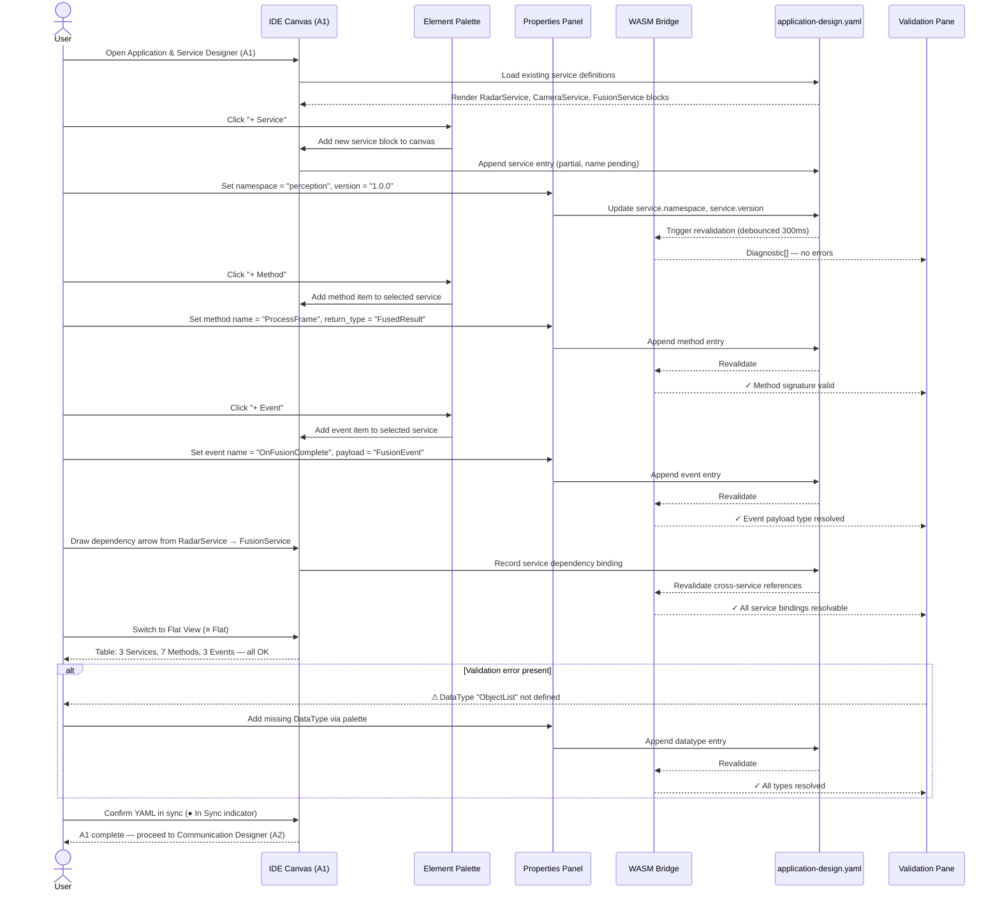

# adaptive-cluster-01-workflow — Application & Service Designer

## Designer: A1 — Application & Service Designer
**YAML file:** `application-design.yaml`

## Overview

This workflow covers the end-to-end sequence of defining Adaptive AUTOSAR applications and their service interfaces inside the Application & Service Designer. The designer exposes services (methods, events, data types) and the dependency graph between producer and consumer applications. Every user action on the canvas is bidirectionally synced to `application-design.yaml` and validated in real time via WASM.

---

## Workflow Steps

1. User opens the Application & Service Designer (tab A1).
2. User creates or selects a service block on the service canvas.
3. User adds methods and events to the service using the Element Palette.
4. User sets service properties (namespace, version) in the Properties panel.
5. WASM validates method signatures and data type references on each edit.
6. User reviews the Flat View table to verify all services, methods, and events.
7. User resolves any validation errors shown in the Validation pane.
8. YAML is confirmed in sync; canvas is ready for Communication Designer (A2).

---

## Sequence Diagram

---

## Key Entities Involved

| Entity | Type | YAML Path |
|---|---|---|
| `RadarService` | Service | `services[0]` |
| `CameraService` | Service | `services[1]` |
| `FusionService` | Service | `services[2]` |
| `GetObjectList` | Method | `services[0].methods[0]` |
| `OnObjectDetected` | Event | `services[0].events[0]` |
| `ProcessFrame` | Method | `services[2].methods[0]` |
| `OnFusionComplete` | Event | `services[2].events[0]` |

---

## Validation Rules (WASM — `adaptive::validation`)

- Every method must declare a `return_type` that resolves to a defined datatype.
- Every event must declare a `payload` type that resolves to a defined datatype.
- Service `namespace` must be a valid reverse-domain identifier.
- No two services in the same namespace may share a name.
- Service `version` must follow semver (`major.minor.patch`).

---

## Outputs

- `application-design.yaml` — updated with all service interfaces.
- Validated service graph ready for binding in **A2 Communication Designer**.
