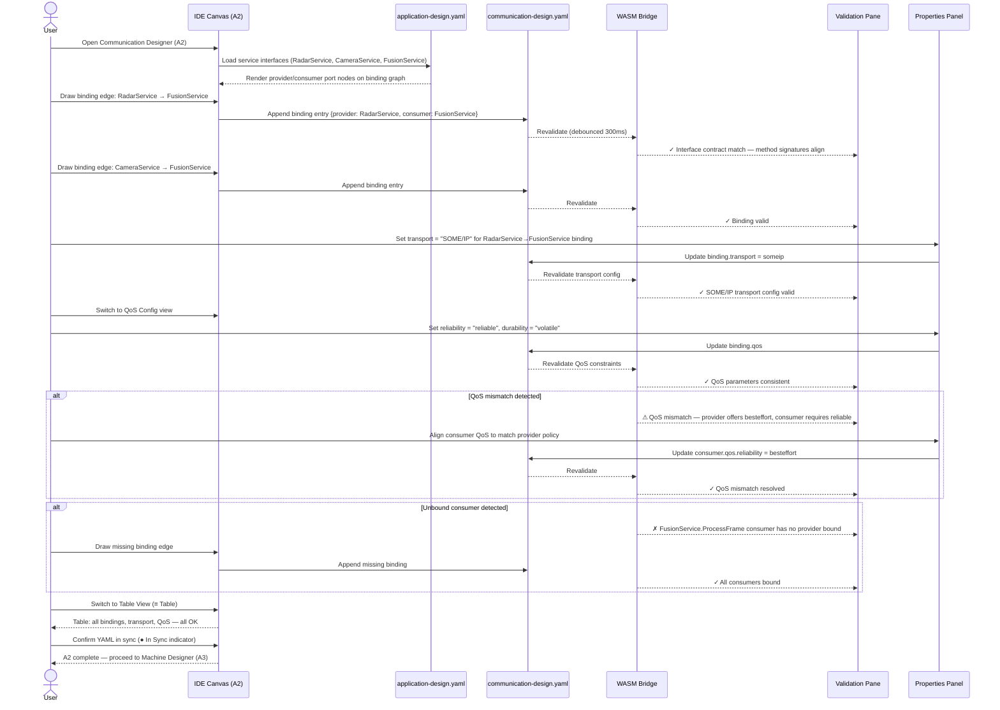

# adaptive-cluster-02-workflow — Communication Designer

## Designer: A2 — Communication Designer
**YAML file:** `communication-design.yaml`

## Overview

This workflow covers binding service providers to consumers, configuring transport protocols (SOME/IP or IPC), and setting QoS parameters in the Communication Designer. The canvas renders a binding graph between service instances across applications. Validation ensures every consumer has a reachable provider and that QoS constraints are consistent. All bindings are persisted to `communication-design.yaml`.

---

## Workflow Steps

1. User opens the Communication Designer (tab A2).
2. Designer loads service interfaces from `application-design.yaml` (A1 output).
3. User draws a binding edge from a consumer service port to a provider service port.
4. WASM validates that the service interface contracts match (method signatures, event payloads).
5. User configures transport protocol (SOME/IP or IPC) for the binding.
6. User sets QoS parameters (reliability, durability, bandwidth budget).
7. Validation confirms all consumers are bound and QoS constraints are satisfiable.
8. User reviews the Table View to audit all bindings.
9. YAML confirmed in sync; canvas ready for Machine Designer (A3).

---

## Sequence Diagram

---

## Key Entities Involved

| Entity | Type | YAML Path |
|---|---|---|
| RadarService → FusionService | Binding | `bindings[0]` |
| CameraService → FusionService | Binding | `bindings[1]` |
| Transport protocol | Config | `bindings[*].transport` |
| Reliability | QoS | `bindings[*].qos.reliability` |
| Durability | QoS | `bindings[*].qos.durability` |

---

## Validation Rules (WASM — `adaptive::validation`)

- Every service consumer port must have exactly one bound provider for each required method/event.
- Provider and consumer must implement the same service interface version (semver compatible).
- QoS reliability of consumer must be ≤ reliability offered by provider.
- SOME/IP bindings require a valid `service_id` and `instance_id`.
- IPC bindings are only valid between applications deployed on the same machine (checked cross-canvas against A6 deployment).

---

## Outputs

- `communication-design.yaml` — all service bindings with transport and QoS config.
- Validated binding graph ready for machine topology in **A3 Machine Designer**.
