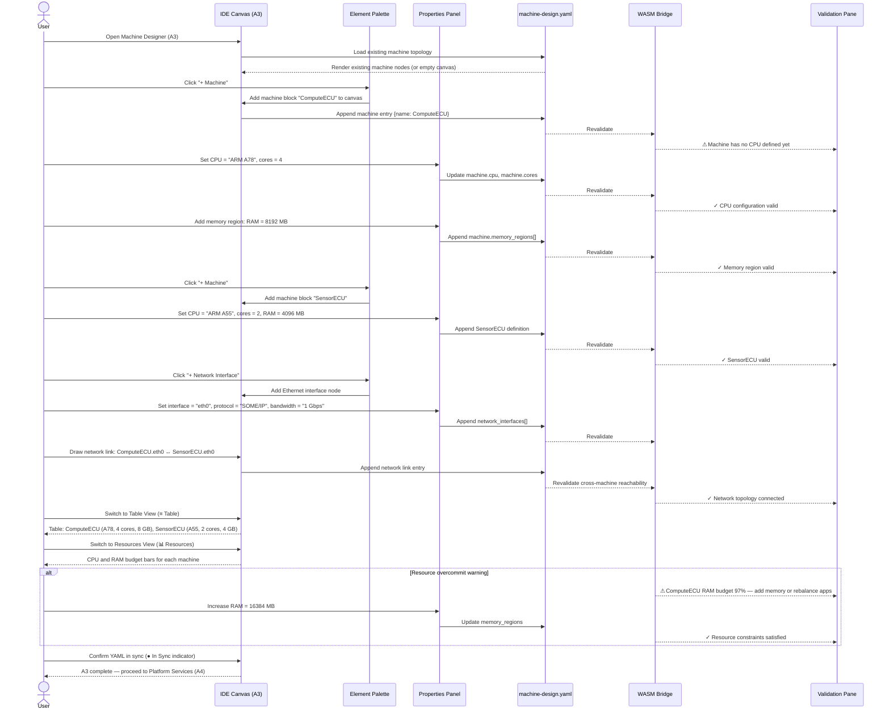

# adaptive-cluster-03-workflow — Machine Designer

## Designer: A3 — Machine Designer
**YAML file:** `machine-design.yaml`

## Overview

This workflow covers defining machine (ECU/HPC) hardware topology in the Machine Designer. Users model machines with their CPU cores, memory regions, and network interfaces. Validation cross-references the execution and deployment requirements from later designers to confirm hardware feasibility. All topology is persisted to `machine-design.yaml`.

---

## Workflow Steps

1. User opens the Machine Designer (tab A3).
2. User adds machine blocks (ECU/HPC nodes) to the topology canvas.
3. User configures each machine with CPU type, core count, and memory regions.
4. User adds network interface nodes and connects machines via network links.
5. WASM validates hardware resource specs (core count, RAM, storage).
6. User reviews the Resources view to check memory/CPU utilization forecasts.
7. User resolves any capacity constraint warnings.
8. YAML confirmed in sync; topology ready for Platform Services (A4) and Execution (A5).

---

## Sequence Diagram

---

## Key Entities Involved

| Entity | Type | YAML Path |
|---|---|---|
| `ComputeECU` | Machine | `machines[0]` |
| `SensorECU` | Machine | `machines[1]` |
| `CameraECU` | Machine | `machines[2]` |
| CPU config | Hardware | `machines[*].cpu` |
| Memory regions | Hardware | `machines[*].memory_regions[]` |
| Network interfaces | Hardware | `machines[*].network_interfaces[]` |
| Network links | Topology | `network_links[]` |

---

## Validation Rules (WASM — `adaptive::validation`)

- Every machine must have at least one CPU defined with a valid core count (≥ 1).
- Memory regions must have unique names and positive sizes.
- Network links must connect two valid machine interfaces; dangling endpoints are errors.
- SOME/IP-bound services (from A2) require machines to have at least one network interface.
- IPC-bound services require both endpoints to eventually be deployed on the same machine (checked cross-canvas at A6).

---

## Outputs

- `machine-design.yaml` — full hardware topology with CPU, memory, and network config.
- Validated machine inventory ready for **A4 Platform Services** and **A5 Execution Designer**.
