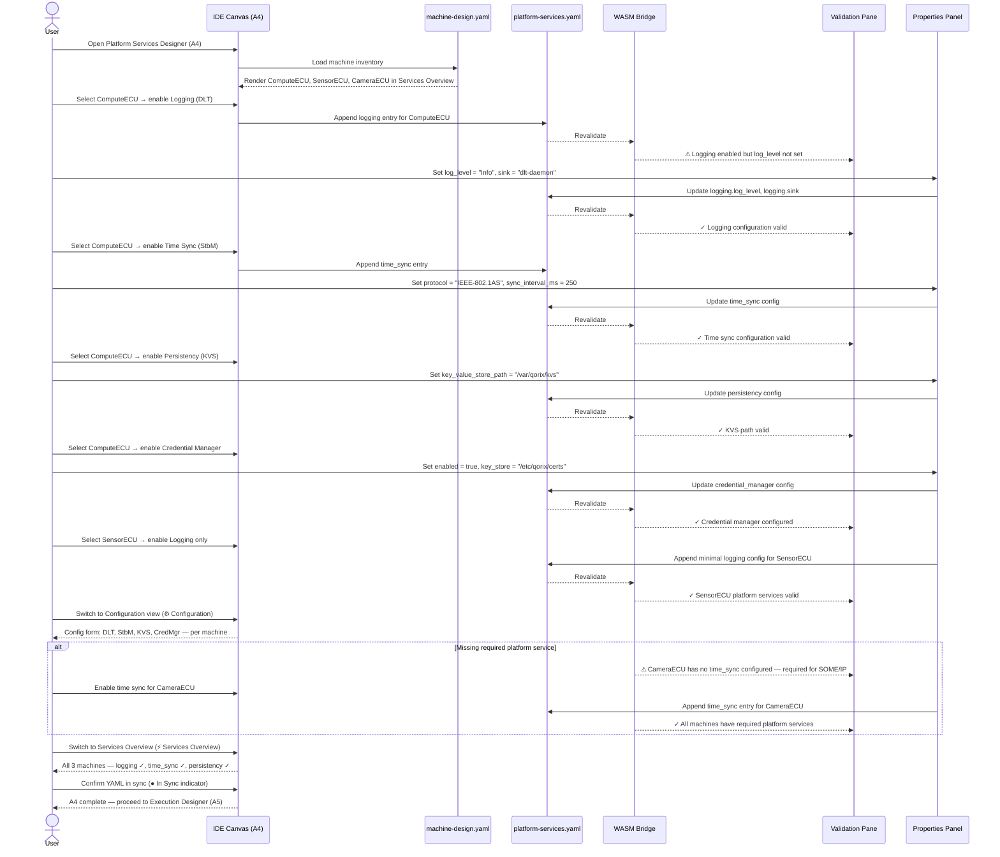

# adaptive-cluster-04-workflow — Platform Services Designer

## Designer: A4 — Platform Services Designer
**YAML file:** `platform-services.yaml`

## Overview

This workflow covers configuring Adaptive AUTOSAR platform services per machine — including logging (DLT), time synchronisation (StbM), persistency (KVS), update manager, and credential manager. The designer presents a services overview canvas and per-service configuration forms. All platform service bindings are per-machine and validated against the machine topology defined in A3.

---

## Workflow Steps

1. User opens the Platform Services Designer (tab A4).
2. Designer loads machine inventory from `machine-design.yaml` (A3 output).
3. User enables or configures platform services for each machine.
4. User sets logging level, log sinks, and DLT daemon config.
5. User sets time sync protocol and accuracy requirements.
6. User configures persistency KVS paths and credential manager settings.
7. WASM validates per-machine service configs (required fields, compatible protocols).
8. User reviews Services Overview to confirm all machines have required platform services.
9. YAML confirmed in sync; platform services ready for Execution Designer (A5).

---

## Sequence Diagram

---

## Key Entities Involved

| Entity | Type | YAML Path |
|---|---|---|
| Logging (DLT) | Platform Service | `machines[*].logging` |
| Time Sync (StbM/IEEE-802.1AS) | Platform Service | `machines[*].time_sync` |
| Persistency (KVS) | Platform Service | `machines[*].persistency` |
| Credential Manager | Platform Service | `machines[*].credential_manager` |
| Update Manager | Platform Service | `machines[*].update_manager` |
| Firewall | Platform Service | `machines[*].firewall` |

---

## Validation Rules (WASM — `adaptive::validation`)

- Logging requires `log_level` (one of: Off, Fatal, Error, Warn, Info, Debug, Verbose) and at least one `sink`.
- Time sync `protocol` must be one of: `IEEE-802.1AS`, `NTP`, `CUSTOM`.
- KVS `key_value_store_path` must be a valid absolute filesystem path.
- Machines with SOME/IP bindings (from A2) must have time sync enabled.
- Firewall `allowed_endpoints` and `denied_endpoints` must not overlap.

---

## Outputs

- `platform-services.yaml` — per-machine platform service configuration.
- Validated platform service inventory ready for **A5 Execution Designer**.
