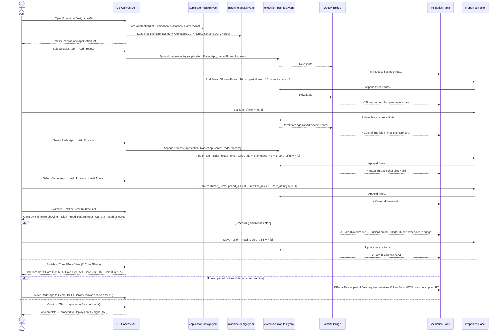

# adaptive-cluster-05-workflow — Execution Designer

## Designer: A5 — Execution Designer
**YAML file:** `execution-manifest.yaml`

## Overview

This workflow covers defining processes, threads, and their scheduling parameters for each application. The Execution Designer maps application executables to processes, configures thread periods, timeslices, and core affinity. It cross-references machine hardware from A3 to validate scheduling feasibility. All execution config is persisted to `execution-manifest.yaml`.

---

## Workflow Steps

1. User opens the Execution Designer (tab A5).
2. Designer loads applications from `application-design.yaml` (A1) and machine topology from `machine-design.yaml` (A3).
3. User creates process entries for each application.
4. User adds thread entries to each process and sets period_ms, timeslice_ms.
5. User assigns core affinity per thread.
6. WASM validates scheduling feasibility (threads fit in timeslice, cores exist on target machine).
7. User reviews the Timeline view to spot scheduling conflicts.
8. User reviews the Core Affinity view to check load distribution.
9. YAML confirmed in sync; execution manifest ready for Deployment Designer (A6).

---

## Sequence Diagram

---

## Key Entities Involved

| Entity | Type | YAML Path |
|---|---|---|
| `FusionProcess` | Process | `processes[0]` |
| `RadarProcess` | Process | `processes[1]` |
| `CameraProcess` | Process | `processes[2]` |
| `FusionThread_10ms` | Thread | `processes[0].threads[0]` |
| Core affinity | Config | `processes[*].threads[*].core_affinity` |
| `restart` policy | Config | `processes[*].restart` |

---

## Validation Rules (WASM — `adaptive::validation`)

- Every application (from A1) must have exactly one process defined.
- Every process must have at least one thread.
- Thread `timeslice_ms` must be < `period_ms`.
- Thread `core_affinity` values must be within `[0, machine.cores - 1]` for the assigned machine (cross-canvas check with A6 deployment binding).
- `restart` policy must be one of: `none`, `on_failure`, `always`.

---

## Outputs

- `execution-manifest.yaml` — process and thread scheduling for all applications.
- Validated execution manifest ready for **A6 Deployment Designer**.
