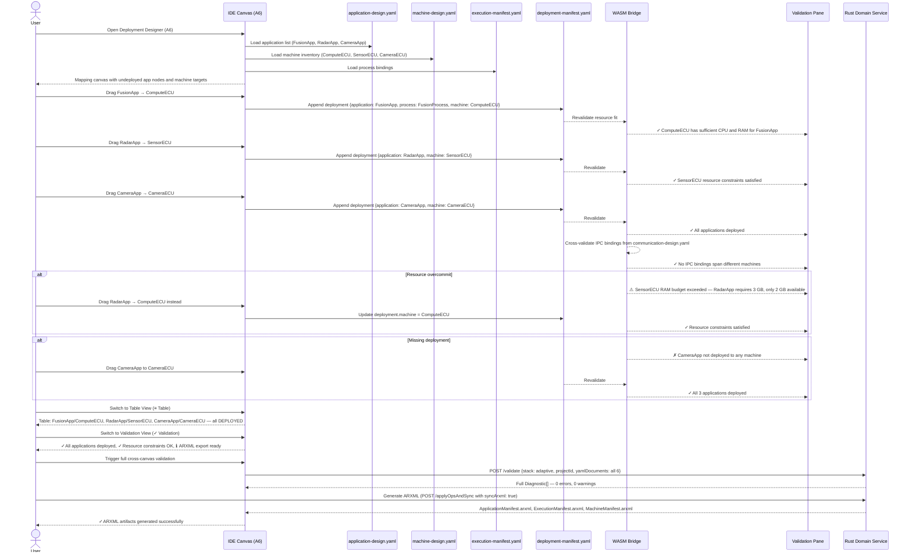

# adaptive-cluster-06-workflow — Deployment Designer

## Designer: A6 — Deployment Designer
**YAML file:** `deployment-manifest.yaml`

## Overview

This workflow covers binding applications and their processes to target machines. The Deployment Designer is the final integration canvas — it draws together services (A1), communication (A2), machine topology (A3), platform services (A4), and execution manifests (A5) into a complete deployment map. Every application must be deployed to exactly one machine. Validation confirms resource constraints, IPC binding feasibility, and complete deployment coverage.

---

## Workflow Steps

1. User opens the Deployment Designer (tab A6).
2. Designer loads all prior outputs: applications (A1), machines (A3), processes (A5).
3. User drags application nodes onto target machine nodes in the Mapping View.
4. WASM validates resource fit (CPU, RAM) per machine.
5. WASM cross-validates IPC bindings (from A2) — both endpoints must be on the same machine.
6. User reviews the Table View to confirm all deployments.
7. User runs the Validation view to get the full cross-canvas checklist.
8. On full pass, system is declared ready for ARXML generation.

---

## Sequence Diagram

---

## Key Entities Involved

| Entity | Type | YAML Path |
|---|---|---|
| `FusionApp → ComputeECU` | Deployment | `deployments[0]` |
| `RadarApp → SensorECU` | Deployment | `deployments[1]` |
| `CameraApp → CameraECU` | Deployment | `deployments[2]` |
| Core affinity | Runtime | `deployments[*].core_affinity` |
| Process reference | Runtime | `deployments[*].process` |

---

## Validation Rules (WASM + Rust Domain Service — `adaptive::validation`)

- Every application must be deployed to exactly one machine.
- Target machine must have sufficient CPU and RAM for the process (cross-referenced from A5 execution manifest).
- IPC bindings (from A2) require both provider and consumer to be on the same machine.
- Core affinity values must not exceed the target machine's core count (from A3).
- All 6 YAML files must pass full cross-canvas validation before ARXML generation is permitted.

---

## Outputs

- `deployment-manifest.yaml` — complete application-to-machine deployment map.
- Full cross-canvas validation pass (all 6 designers).
- **ARXML artifacts:** `ApplicationManifest.arxml`, `ExecutionManifest.arxml`, `MachineManifest.arxml` generated via ARXML Gateway.
