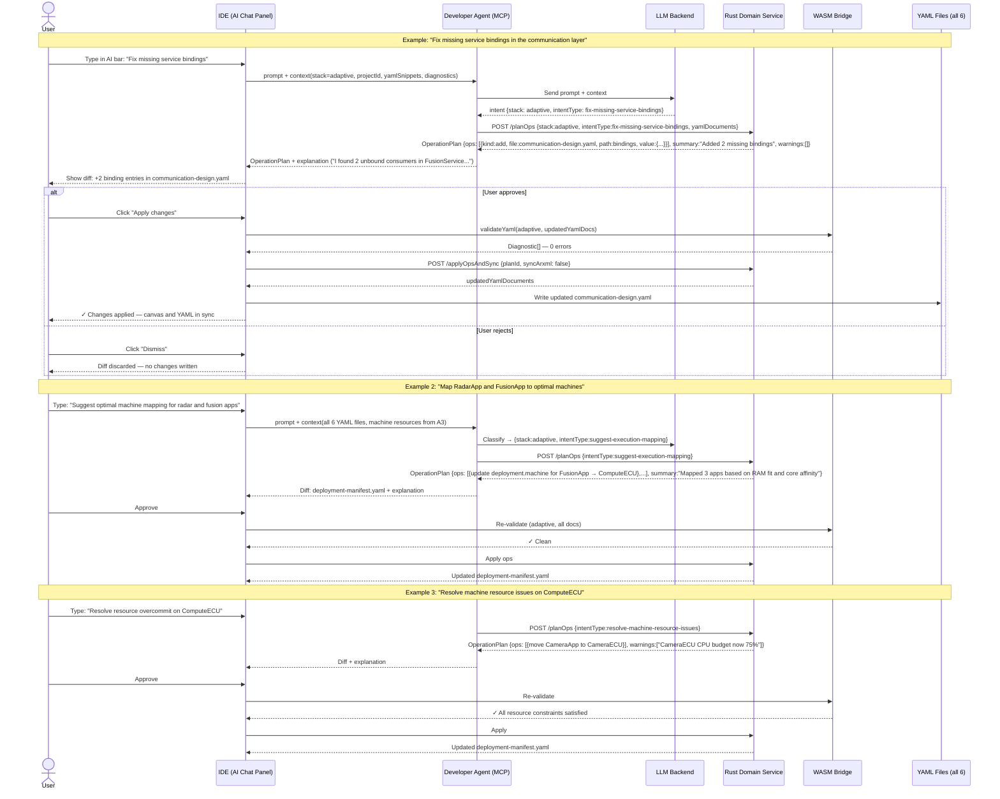

# adaptive-cluster-07-workflow — AI-Assist Workflow (Adaptive)

## Designer: All Adaptive Designers (A1–A6) — AI-Assist Integration
**Context:** Cross-canvas AI-assisted configuration fixes and proposals

## Overview

This workflow covers the AI-Assist integration pattern across all six Adaptive AUTOSAR designers. The user invokes the AI chat panel from any designer, the MCP agent classifies the intent, calls the Rust Domain Service for a structured `OperationPlan`, and presents a diff for user review and approval. AI never writes YAML directly — all mutations go through Rust ops and are re-validated by WASM after apply.

---

## Workflow Steps

1. User encounters a validation error or wants to accelerate a configuration task.
2. User opens the AI chat bar and types a natural language intent.
3. MCP agent sends prompt + current YAML context + diagnostics to LLM Backend.
4. LLM classifies the intent (stack, intentType).
5. MCP agent calls `POST /planOps` on Rust Domain Service.
6. Rust computes a structured `OperationPlan` (never guessed by LLM).
7. MCP returns `OperationPlan` + LLM explanation to IDE.
8. IDE shows diff preview to user.
9. User approves or rejects.
10. On approval: WASM re-validates the updated YAML; if clean, changes are written.

---

## Sequence Diagram

---

## AI Intent → Tool Mapping (Adaptive Stack)

| User Intent (natural language) | Classified `intentType` | Rust Tool |
|---|---|---|
| "Fix missing service bindings" | `fix-missing-service-bindings` | `fix_missing_service_bindings` |
| "Map apps to optimal machines" | `suggest-execution-mapping` | `suggest_execution_mapping` |
| "Resolve resource overcommit" | `resolve-machine-resource-issues` | `resolve_machine_resource_issues` |
| "Suggest SOME/IP bindings" | `suggest-service-bindings` | `suggest_service_bindings` |
| "Validate the whole project" | `validate_project` | `validate_project` |
| "Summarize issues" | `summarize_diagnostics` | `summarize_diagnostics` |

---

## Safety Invariants

- LLM never writes YAML or calls the ARXML Gateway directly.
- Every proposed change is expressed as a `core::ops` `OperationPlan` from Rust.
- WASM re-validates all affected YAML documents before changes are written.
- User must explicitly approve every AI-proposed diff.
- Plan is discarded without trace if user rejects.

---

## Outputs

- Updated YAML files in affected designers, all validated clean.
- Structured `OperationPlan` audit trail for every AI-applied change.
