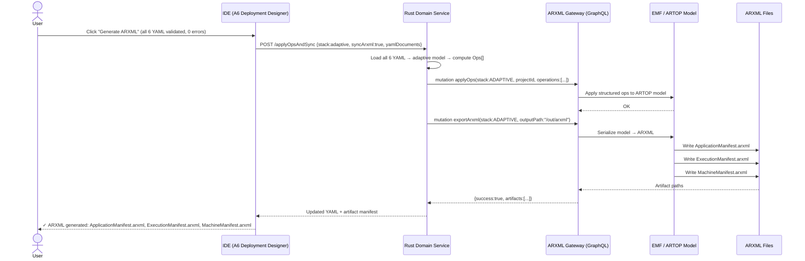
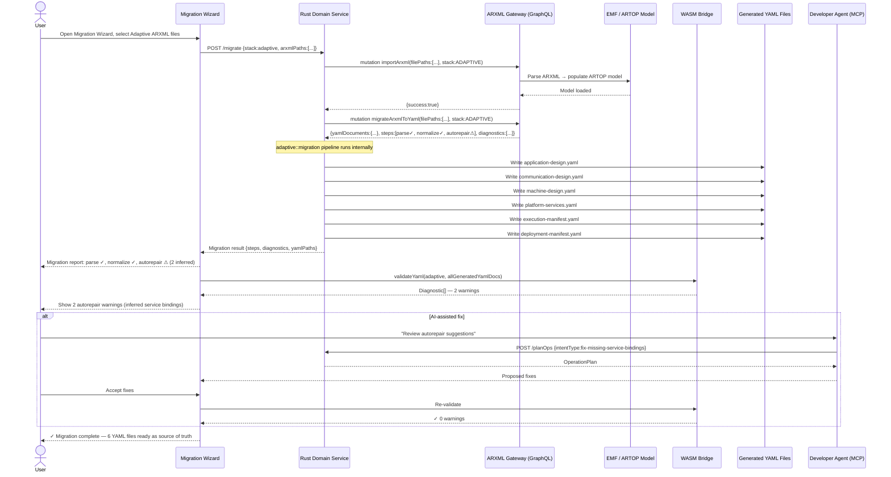

# adaptive-cluster-08-workflow — ARXML Export & Migration (Adaptive)

## Designer: A6 Deployment Designer → ARXML Gateway
**Context:** End-to-end ARXML generation and legacy ARXML import/migration for Adaptive stack

## Overview

This workflow covers two complementary flows:
1. **Export:** Converting a completed, validated Adaptive AUTOSAR YAML project to ARXML artifacts (ApplicationManifest, ExecutionManifest, MachineManifest) for downstream toolchains.
2. **Import/Migration:** Loading an existing Adaptive ARXML project into Qorix, running autorepair/normalization, and producing the six YAML files as the new source of truth.

Both flows go through the Rust Domain Service and ARXML Gateway (Spring Boot + ARTOP + GraphQL). Rust never touches ARXML or EMF directly.

---

## Part 1 — Export Flow (YAML → ARXML)

### Workflow Steps

1. All 6 Adaptive YAML files are validated (full cross-canvas pass).
2. User triggers "Generate ARXML" from the Deployment Designer or CLI.
3. Rust Domain Service computes an `OperationPlan` for the full model sync.
4. `core::gql_client` sends `applyOps` mutation to ARXML Gateway.
5. ARXML Gateway applies ops to EMF/ARTOP model.
6. `exportArxml` mutation triggers serialization to `.arxml` files.
7. ARXML artifacts are written to the output directory.

---

## Part 2 — Import / Migration Flow (ARXML → YAML)

### Workflow Steps

1. User opens Migration Wizard and selects Adaptive ARXML files.
2. ARXML Gateway loads files into EMF/ARTOP model via `importArxml`.
3. `adaptive::migration` pipeline runs: parse → normalize → autorepair → report.
4. Normalized YAML files are generated and written to the project directory.
5. WASM validates the generated YAML files.
6. User reviews migration diagnostics and AI-assisted fix proposals for any warnings.
7. User accepts fixes; YAML files are confirmed as new source of truth.

---

## ARXML Artifacts Produced (Adaptive Export)

| Artifact | Content |
|---|---|
| `ApplicationManifest.arxml` | Service interfaces, methods, events, data types |
| `ExecutionManifest.arxml` | Process definitions, thread configs, functional groups |
| `MachineManifest.arxml` | Hardware topology, platform services, network config |

---

## Migration Autorepair Capabilities (Adaptive)

| Autorepair Action | Trigger |
|---|---|
| Infer service binding transport | Binding has no transport specified → default SOME/IP |
| Normalize service interface names | CamelCase/snake_case normalisation |
| Infer thread period from OS config | Thread with no period → derived from execution manifest context |
| Missing machine → create placeholder | Application deployed to undefined machine |

---

## Key Design Constraints

- Rust never reads or writes `.arxml` files directly — all ARXML IO goes through the ARXML Gateway.
- Import/export flows are identical between IDE (interactive) and CLI (`qorix generate-arxml`, `qorix migrate`) — same Rust domain core.
- The generated YAML is the new source of truth after migration — ARXML is not kept as working copy.
- ARXML version normalisation (R19-11 vs R21-11 etc.) is handled transparently by `AutosarVersionAdapter` inside the gateway.
