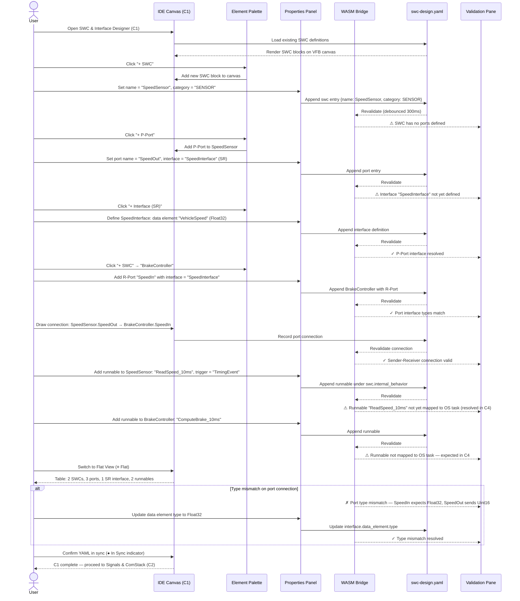

# classic-cluster-01-workflow — SWC & Interface Designer

## Designer: C1 — SWC & Interface Designer
**YAML file:** `swc-design.yaml`

## Overview

This workflow covers defining AUTOSAR Classic Software Components (SWCs), their ports (Provided/Required/Client-Server/Sender-Receiver), interfaces, runnables, and inter-runnable variables in the SWC & Interface Designer. The canvas displays the Virtual Functional Bus (VFB) view showing SWC port connections. Every change is bidirectionally synced to `swc-design.yaml` and validated by WASM in real time.

---

## Workflow Steps

1. User opens the SWC & Interface Designer (tab C1).
2. User creates SWC blocks on the VFB canvas.
3. User adds ports (P-Port / R-Port) to each SWC.
4. User creates interface definitions (SenderReceiver or ClientServer) and assigns to ports.
5. User connects ports between SWCs via data element links.
6. User adds runnables to each SWC's Internal Behavior.
7. WASM validates port types, interface compatibility, and runnable declarations.
8. User reviews the Flat View table to audit all SWCs, ports, and interfaces.
9. YAML confirmed in sync; SWC design ready for ComStack (C2) and OS Scheduling (C4).

---

## Sequence Diagram

---

## Key Entities Involved

| Entity | Type | YAML Path |
|---|---|---|
| `SpeedSensor` | SWC | `swcs[0]` |
| `BrakeController` | SWC | `swcs[1]` |
| `SpeedOut` | P-Port (SR) | `swcs[0].ports[0]` |
| `SpeedIn` | R-Port (SR) | `swcs[1].ports[0]` |
| `SpeedInterface` | Interface (SR) | `interfaces[0]` |
| `ReadSpeed_10ms` | Runnable | `swcs[0].internal_behavior.runnables[0]` |
| `ComputeBrake_10ms` | Runnable | `swcs[1].internal_behavior.runnables[0]` |

---

## Validation Rules (WASM — `classic::validation`)

- Every port must reference a declared interface.
- SR P-Port and R-Port must reference the same interface with compatible data element types.
- CS P-Port (Server) and R-Port (Client) must reference the same ClientServer interface.
- Runnable trigger type must be one of: `TimingEvent`, `DataReceivedEvent`, `InitEvent`, `BackgroundEvent`.
- Runnables without OS task mapping produce warnings (resolved in C4).

---

## Outputs

- `swc-design.yaml` — all SWCs, ports, interfaces, and runnables.
- Validated SWC graph ready for signal binding in **C2 Signals & ComStack** and task mapping in **C4 OS & Scheduling**.
