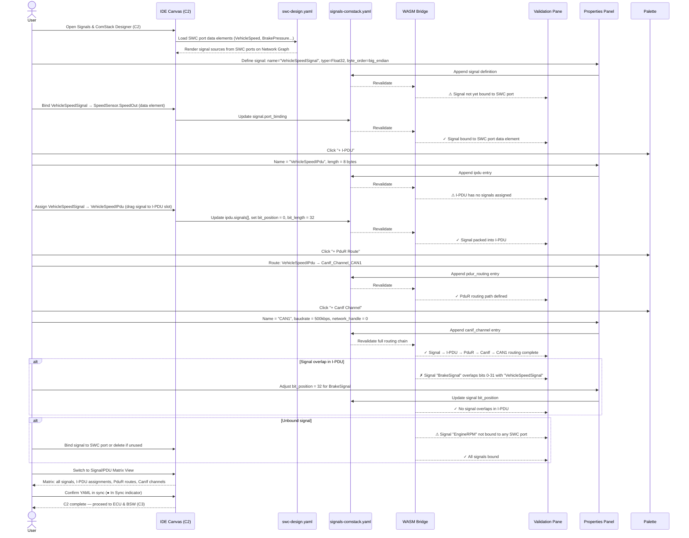

# classic-cluster-02-workflow — Signals & ComStack Designer

## Designer: C2 — Signals & ComStack Designer
**YAML file:** `signals-comstack.yaml`

## Overview

This workflow covers defining communication signals, I-PDUs, PDUs, and the COM/PduR/CanIf routing stack in the Signals & ComStack Designer. Signals are bound to SWC ports (from C1), packed into I-PDUs, routed through PduR, and transmitted via CanIf channels. The Network Graph view shows bus topology with PDUs and signals. Validation ensures complete routing paths from SWC data element to bus frame.

---

## Workflow Steps

1. User opens the Signals & ComStack Designer (tab C2).
2. Designer loads SWC port data elements from `swc-design.yaml` (C1 output).
3. User defines signals (name, data type, byte order).
4. User binds each signal to an SWC port data element.
5. User creates I-PDUs and assigns signals to I-PDU positions.
6. User creates PDU routing paths in PduR.
7. User configures CanIf channels and assigns I-PDUs to channels.
8. WASM validates the complete routing chain (signal → I-PDU → PduR → CanIf → bus).
9. User reviews the Signal/PDU Matrix view.
10. YAML confirmed in sync; ComStack ready for ECU/BSW (C3) and RTE mapping (C6).

---

## Sequence Diagram

---

## Key Entities Involved

| Entity | Type | YAML Path |
|---|---|---|
| `VehicleSpeedSignal` | Signal | `signals[0]` |
| `VehicleSpeedIPdu` | I-PDU | `ipdus[0]` |
| PduR route | Routing | `pdur_routings[0]` |
| `CAN1` | CanIf Channel | `canif_channels[0]` |
| Signal bit position | Config | `ipdus[0].signals[0].bit_position` |

---

## Validation Rules (WASM — `classic::validation`)

- Every signal must be bound to exactly one SWC port data element (from `swc-design.yaml`).
- Signals within an I-PDU must not have overlapping bit ranges.
- Total signal bits in an I-PDU must not exceed `length_bytes * 8`.
- Every I-PDU must have at least one PduR routing path.
- Every PduR routing path must terminate at a valid CanIf channel.
- CanIf channel baudrate must be a valid CAN standard (125k, 250k, 500k, 1M).

---

## Outputs

- `signals-comstack.yaml` — all signals, I-PDUs, PduR routing, and CanIf channel config.
- Validated ComStack ready for BSW module config in **C3 ECU & BSW** and port-signal mapping in **C6 RTE & Mapping**.
