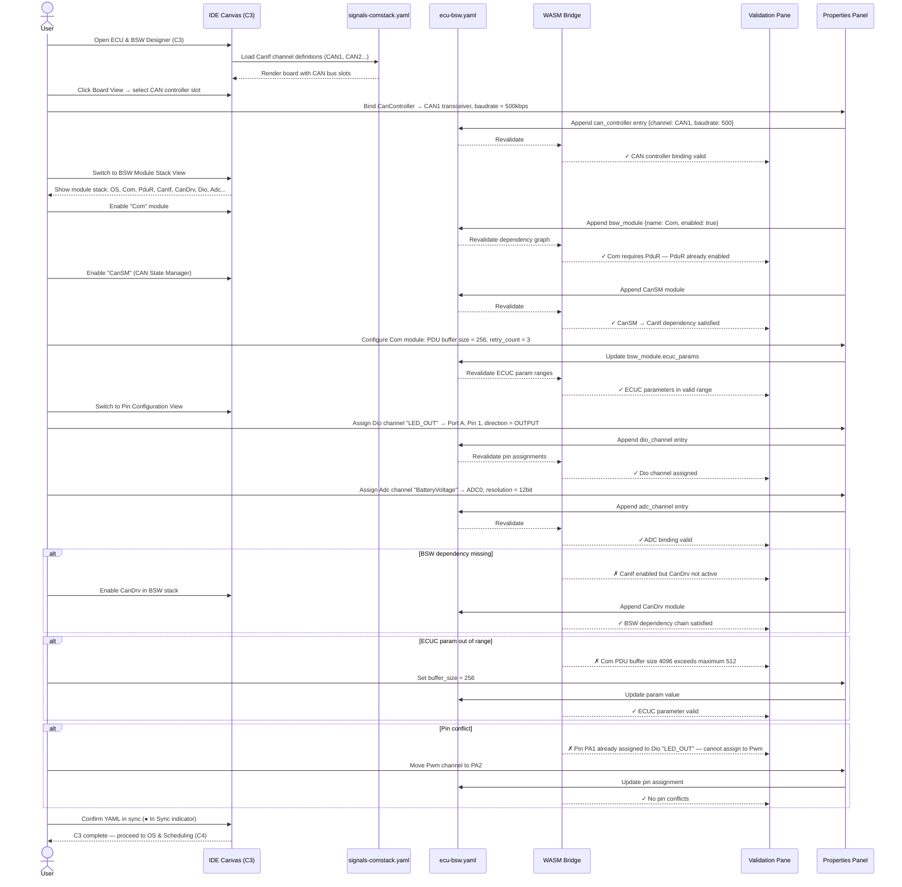

# classic-cluster-03-workflow — ECU & BSW Designer

## Designer: C3 — ECU & BSW Designer
**YAML file:** `ecu-bsw.yaml`

## Overview

This workflow covers configuring the ECU board, BSW modules, and MCAL bindings in the ECU & BSW Designer. The Board View renders the ECU with its peripheral slots (CAN, LIN, SPI, Dio, Adc, Pwm ports). Users configure which BSW modules are active, set ECUC module parameters, and bind MCAL drivers to physical hardware pins. Validation checks BSW dependency ordering, MCAL binding completeness, and ECUC parameter ranges.

---

## Workflow Steps

1. User opens the ECU & BSW Designer (tab C3).
2. Designer loads CanIf channel definitions from `signals-comstack.yaml` (C2 output).
3. User selects active BSW modules from the module stack (ComStack, MCAL, OS, NvM, etc.).
4. User configures ECUC parameters for each module (timeouts, buffer sizes, error handling).
5. User binds MCAL drivers to physical pins (e.g., CAN controller → CAN1 transceiver).
6. User configures GPIO/Dio channel assignments.
7. WASM validates BSW dependency graph, ECUC parameter ranges, MCAL pin conflicts.
8. User reviews Board View and BSW Module Stack view.
9. YAML confirmed in sync; ECU/BSW config ready for OS Scheduling (C4) and NvM (C5).

---

## Sequence Diagram

---

## Key Entities Involved

| Entity | Type | YAML Path |
|---|---|---|
| `Com` | BSW Module | `bsw_modules[0]` |
| `PduR` | BSW Module | `bsw_modules[1]` |
| `CanIf` | BSW Module | `bsw_modules[2]` |
| `CanDrv` | BSW Module (MCAL) | `bsw_modules[3]` |
| `LED_OUT` | Dio Channel | `dio_channels[0]` |
| `BatteryVoltage` | ADC Channel | `adc_channels[0]` |
| CAN controller binding | MCAL | `can_controllers[0]` |

---

## Validation Rules (WASM — `classic::validation`)

- Every enabled BSW module's upstream dependencies must also be enabled.
- Com requires PduR; CanIf requires CanDrv; CanSM requires CanIf.
- ECUC parameters must be within module-specified valid ranges.
- No two MCAL channels may share the same physical pin.
- CanIf channel names must match exactly the CanIf channels defined in `signals-comstack.yaml`.
- Dio direction must be one of: `INPUT`, `OUTPUT`, `INPUT_OUTPUT`.

---

## Outputs

- `ecu-bsw.yaml` — BSW module stack, ECUC parameters, MCAL pin assignments.
- Validated ECU/BSW config ready for task scheduling in **C4 OS & Scheduling** and NvM layout in **C5 Memory & NvM**.
