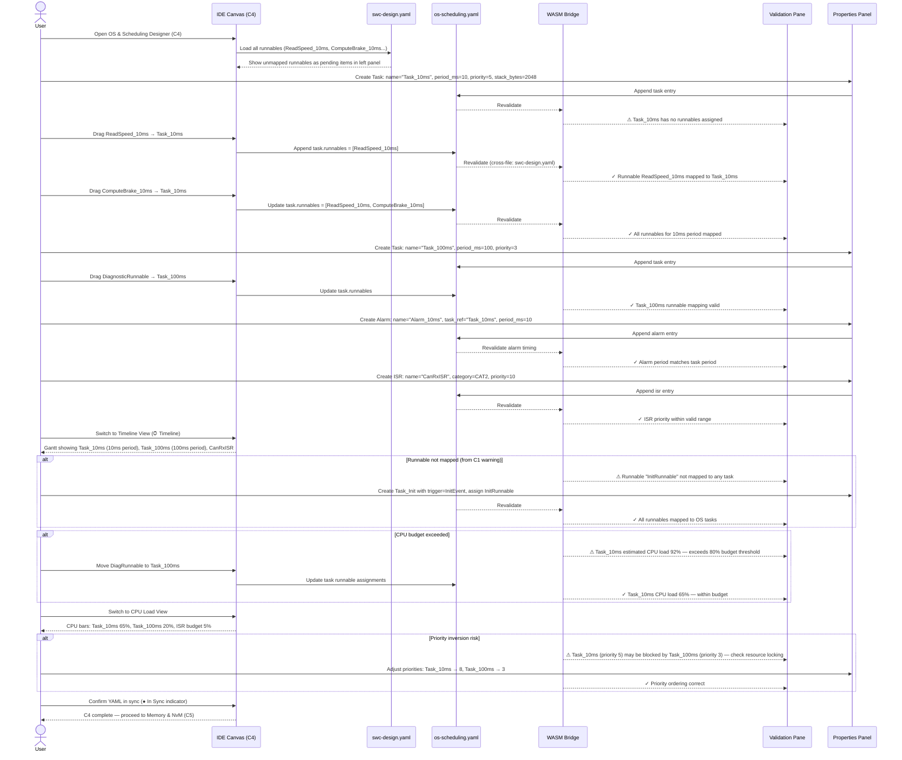

# classic-cluster-04-workflow — OS & Scheduling Designer

## Designer: C4 — OS & Scheduling Designer
**YAML file:** `os-scheduling.yaml`

## Overview

This workflow covers defining AUTOSAR OS tasks, ISRs, alarms, events, and OS applications in the OS & Scheduling Designer. The Timeline view shows task periods graphically. Users assign runnables (from C1) to tasks here — this is where the "runnable not mapped" warnings from C1 are resolved. Validation checks CPU budget, runnable coverage, alarm consistency, and OS application partitioning.

---

## Workflow Steps

1. User opens the OS & Scheduling Designer (tab C4).
2. Designer loads runnables from `swc-design.yaml` (C1) — shows unmapped runnables as pending.
3. User creates OS tasks (periodic, event-triggered, background).
4. User sets task period, priority, and stack size.
5. User assigns runnables to tasks (resolving C1 warnings).
6. User creates alarms and links them to tasks.
7. User creates OS ISRs for interrupt-driven execution.
8. WASM validates: all runnables mapped, CPU budget feasible, alarm periods consistent.
9. User reviews Timeline view for scheduling conflicts.
10. User reviews CPU Load view for budget analysis.
11. YAML confirmed in sync; OS config ready for RTE Mapping (C6).

---

## Sequence Diagram

---

## Key Entities Involved

| Entity | Type | YAML Path |
|---|---|---|
| `Task_10ms` | OS Task | `tasks[0]` |
| `Task_100ms` | OS Task | `tasks[1]` |
| `ReadSpeed_10ms` | Runnable ref | `tasks[0].runnables[0]` |
| `Alarm_10ms` | OS Alarm | `alarms[0]` |
| `CanRxISR` | ISR | `isrs[0]` |
| `Task_Init` | OS Task | `tasks[2]` |

---

## Validation Rules (WASM — `classic::validation`)

- Every runnable declared in `swc-design.yaml` must be assigned to exactly one OS task.
- Task priority must be unique across all tasks (no two tasks at the same priority level).
- ISR category must be `CAT1` or `CAT2`; CAT1 ISRs may not call OS services.
- Alarm `task_ref` must reference a valid defined task.
- Alarm period must equal or be a multiple of the referenced task's period.
- Estimated CPU load per task period must not exceed configurable budget threshold (default 80%).

---

## Outputs

- `os-scheduling.yaml` — all tasks, ISRs, alarms, events, and runnable assignments.
- All C1 "runnable not mapped" warnings resolved.
- Validated OS config ready for RTE wiring in **C6 RTE & Mapping**.
