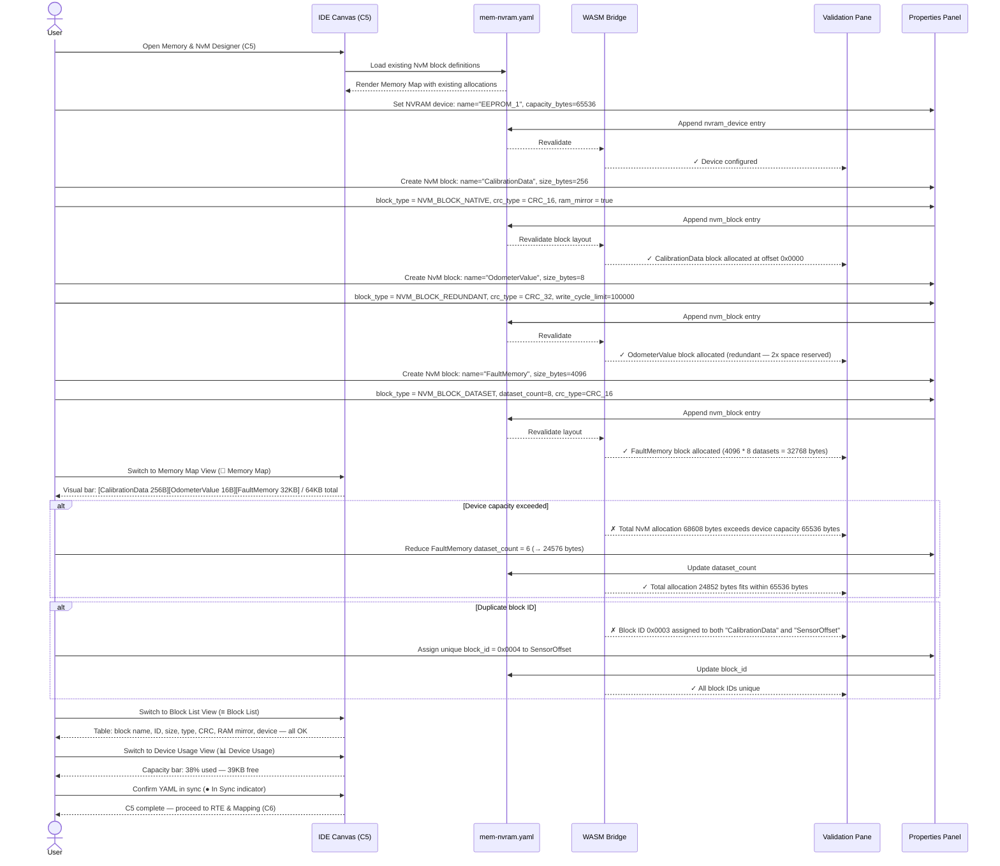

# classic-cluster-05-workflow — Memory & NvM Designer

## Designer: C5 — Memory & NvM Designer
**YAML file:** `mem-nvram.yaml`

## Overview

This workflow covers defining AUTOSAR NvM (Non-Volatile Memory) blocks, their layout in NVRAM, and device capacity configuration in the Memory & NvM Designer. The Memory Map view shows blocks allocated against device address space. Users create NvM blocks, set sizes, RAM mirror config, and CRC protection. Validation checks total block usage against device capacity and block ID uniqueness.

---

## Workflow Steps

1. User opens the Memory & NvM Designer (tab C5).
2. User selects the target NVRAM device and sets total capacity.
3. User creates NvM blocks for each persistent data set.
4. User configures each block: size, NvM block type, RAM mirror, CRC type, write cycle.
5. WASM validates: total block sizes fit within device capacity, unique block IDs, valid CRC types.
6. User reviews the Memory Map view to see block layout visually.
7. User reviews the Block List view for a tabular audit.
8. User reviews the Device Usage view for capacity analysis.
9. YAML confirmed in sync; NvM config ready for RTE Mapping (C6).

---

## Sequence Diagram

---

## Key Entities Involved

| Entity | Type | YAML Path |
|---|---|---|
| `EEPROM_1` | NVRAM Device | `nvram_devices[0]` |
| `CalibrationData` | NvM Block (NATIVE) | `nvm_blocks[0]` |
| `OdometerValue` | NvM Block (REDUNDANT) | `nvm_blocks[1]` |
| `FaultMemory` | NvM Block (DATASET) | `nvm_blocks[2]` |
| Block ID | Config | `nvm_blocks[*].block_id` |
| CRC type | Config | `nvm_blocks[*].crc_type` |

---

## Validation Rules (WASM — `classic::validation`)

- Sum of all NvM block allocations (including REDUNDANT×2 and DATASET×dataset_count) must fit within device capacity.
- Every NvM block must have a unique `block_id` within the project.
- `block_type` must be one of: `NVM_BLOCK_NATIVE`, `NVM_BLOCK_REDUNDANT`, `NVM_BLOCK_DATASET`.
- `crc_type` must be one of: `NVM_CRC_8`, `NVM_CRC_16`, `NVM_CRC_32`, `NVM_CRC_NONE`.
- `dataset_count` is only valid when `block_type = NVM_BLOCK_DATASET`; ignored otherwise.
- `write_cycle_limit` must be positive if specified.

---

## Outputs

- `mem-nvram.yaml` — all NvM block definitions, device config, and layout.
- Validated NvM layout ready for RTE data element binding in **C6 RTE & Mapping**.
