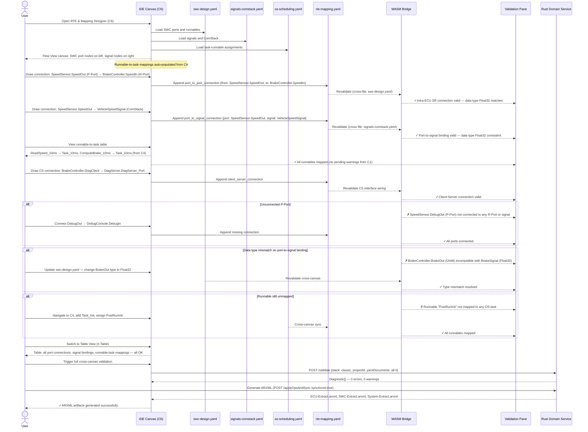

# classic-cluster-06-workflow — RTE & Mapping Designer

## Designer: C6 — RTE & Mapping Designer
**YAML file:** `rte-mapping.yaml`

## Overview

This workflow covers the final integration step in Classic AUTOSAR design — wiring the Runtime Environment (RTE). The RTE & Mapping Designer connects SWC ports (C1) to communication signals (C2) and maps runnables (C1) to OS tasks (C4). This is the cross-cutting integration canvas: every SWC port must be connected either to another SWC port (intra-ECU) or to a ComStack signal (inter-ECU). Validation is the most comprehensive in the Classic pipeline, producing errors for any unconnected port or unmapped runnable.

---

## Workflow Steps

1. User opens the RTE & Mapping Designer (tab C6).
2. Designer loads all SWC ports (C1), signals (C2), and task assignments (C4).
3. User draws port-to-port connections for intra-ECU communication.
4. User draws port-to-signal connections for inter-ECU communication via ComStack.
5. User reviews runnable-to-task mappings imported from C4 (auto-populated).
6. User adds client-server port connections (CS interface wiring).
7. WASM validates: all ports connected, all runnables mapped, data type consistency.
8. User runs full cross-canvas validation via Rust Domain Service.
9. On clean pass, system is ready for ARXML generation.

---

## Sequence Diagram

---

## Key Entities Involved

| Entity | Type | YAML Path |
|---|---|---|
| SpeedSensor.SpeedOut → BrakeController.SpeedIn | Port-to-port (SR) | `port_connections[0]` |
| SpeedSensor.SpeedOut → VehicleSpeedSignal | Port-to-signal | `signal_mappings[0]` |
| ReadSpeed_10ms → Task_10ms | Runnable-to-task | `runnable_mappings[0]` |
| BrakeController.DiagClient → DiagServer | Client-server wiring | `cs_connections[0]` |

---

## Validation Rules (WASM + Rust Domain Service — `classic::validation`)

- Every SWC P-Port must be connected to at least one R-Port or signal.
- Every SWC R-Port must be connected to exactly one P-Port or signal.
- SR port-to-port connections must use the same interface and matching data element types.
- CS client port must connect to a server port with the same operation list.
- Port-to-signal bindings must have matching data types between port data element and signal type.
- Every runnable from `swc-design.yaml` must appear in exactly one runnable-task mapping.
- All 6 YAML files must pass full cross-canvas validation before ARXML generation is permitted.

---

## Outputs

- `rte-mapping.yaml` — all port connections, signal bindings, and runnable-to-task mappings.
- Full cross-canvas validation pass (all 6 Classic designers).
- **ARXML artifacts:** `ECU-Extract.arxml`, `SWC-Extract.arxml`, `System-Extract.arxml` generated via ARXML Gateway.
