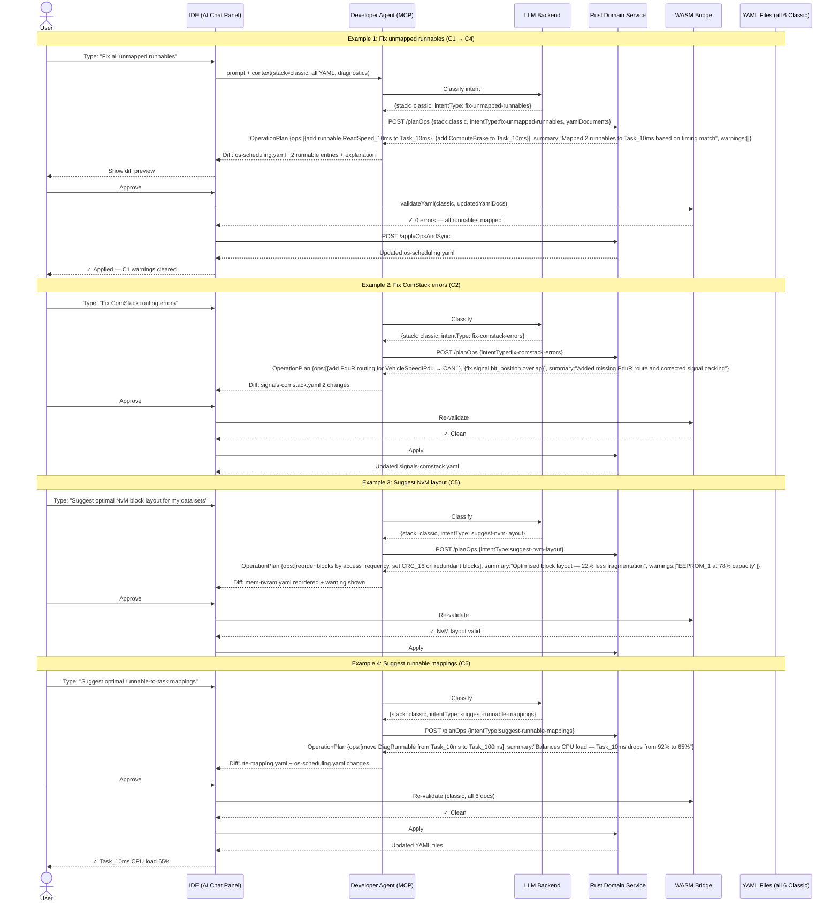

# classic-cluster-07-workflow — AI-Assist Workflow (Classic)

## Designer: All Classic Designers (C1–C6) — AI-Assist Integration
**Context:** Cross-canvas AI-assisted configuration fixes and proposals for Classic AUTOSAR

## Overview

This workflow covers the AI-Assist integration pattern across all six Classic AUTOSAR designers. Users invoke the AI chat bar from any designer canvas. The MCP agent classifies the intent, routes to the appropriate Classic-specific Rust tool, and returns a structured `OperationPlan` for user review. AI never writes YAML directly — all mutations are Rust-computed ops, re-validated by WASM after apply.

---

## Workflow Steps

1. User encounters validation errors (unmapped runnables, ComStack gaps, NvM conflicts, etc.) or wants to accelerate configuration.
2. User opens the AI chat bar and types a natural language intent.
3. MCP agent assembles context (all 6 YAML files + current diagnostics).
4. LLM classifies intent → `intentType` + `stack: classic`.
5. MCP calls `POST /planOps` on Rust Domain Service.
6. Rust computes deterministic `OperationPlan`.
7. MCP returns diff + LLM explanation.
8. User reviews diff and approves or rejects.
9. On approval: WASM re-validates; if clean, YAML is updated.

---

## Sequence Diagram

---

## AI Intent → Tool Mapping (Classic Stack)

| User Intent (natural language) | Classified `intentType` | Rust Tool |
|---|---|---|
| "Fix unmapped runnables" | `fix-unmapped-runnables` | `fix_unmapped_runnables` |
| "Fix ComStack / PDU routing errors" | `fix-comstack-errors` | `fix_comstack_errors` |
| "Suggest runnable task assignments" | `suggest-runnable-mappings` | `suggest_runnable_mappings` |
| "Fix unbound signals" | `fix-unmapped-signals` | `fix_unmapped_signals` |
| "Suggest NvM block layout" | `suggest-nvm-layout` | `suggest_nvm_layout` |
| "Validate the whole project" | (shared) | `validate_project` |
| "Summarize all errors" | (shared) | `summarize_diagnostics` |

---

## AI-Assist Integration Points per Designer

| Designer | Primary AI-Assist capability |
|---|---|
| C1 SWC & Interface | Suggest port-interface type corrections |
| C2 Signals & ComStack | Fix signal-to-PDU packing, PduR routing gaps |
| C3 ECU & BSW | Resolve BSW dependency chain, MCAL pin conflicts |
| C4 OS & Scheduling | Map all unmapped runnables, balance CPU load |
| C5 Memory & NvM | Suggest NvM layout, fix capacity overcommit |
| C6 RTE & Mapping | Auto-wire RTE connections, suggest runnable mappings |

---

## Safety Invariants

- LLM never writes `swc-design.yaml`, `os-scheduling.yaml`, or any YAML file directly.
- All mutations are `core::ops` `OperationPlan` entries computed deterministically by Rust.
- WASM re-validates all 6 YAML files after every approved AI change.
- User must explicitly approve every diff; rejected diffs leave no state.
- Cross-canvas changes (e.g., runnable mapping touching both C1 and C4) are expressed as a single atomic `OperationPlan` applied together.

---

## Outputs

- Updated YAML files in affected designers, all validated clean.
- Structured `OperationPlan` audit trail for every AI-applied change.
