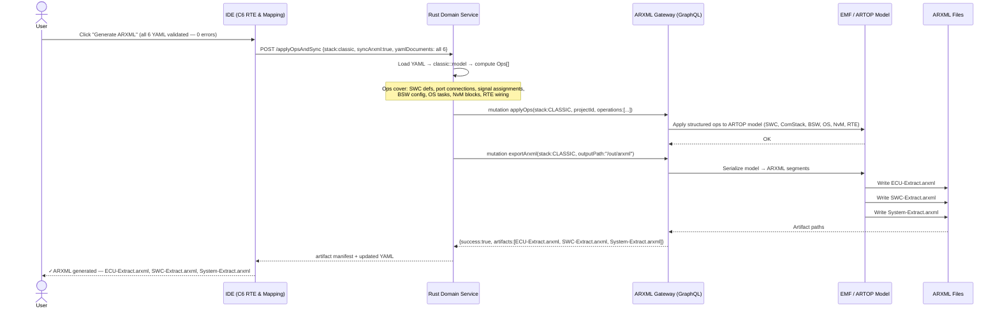
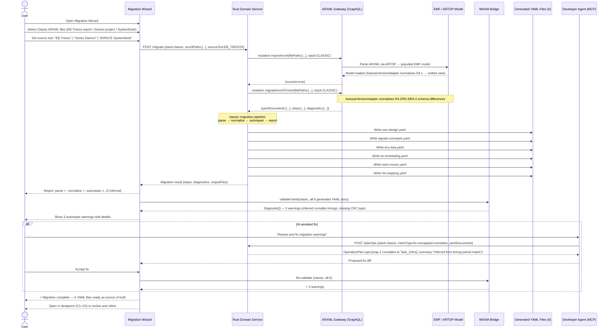

# classic-cluster-08-workflow — ARXML Export & Migration (Classic)

## Designer: C6 RTE & Mapping Designer → ARXML Gateway
**Context:** End-to-end ARXML generation and legacy ARXML import/migration for Classic AUTOSAR

## Overview

This workflow covers two complementary flows for the Classic AUTOSAR stack:
1. **Export:** Converting a completed, validated Classic AUTOSAR YAML project to ARXML artifacts (ECU-Extract, SWC-Extract, System-Extract) for downstream toolchains and legacy tools (EB Tresos, Vector Davinci, dSPACE SystemDesk).
2. **Import/Migration:** Loading an existing Classic ARXML project from legacy tools into Qorix, running autorepair/normalization, and producing the six YAML files as the new source of truth.

Both flows route through Rust Domain Service → ARXML Gateway (Spring Boot + ARTOP + GraphQL). Rust never touches `.arxml` files or EMF objects directly.

---

## Part 1 — Export Flow (YAML → ARXML)

### Workflow Steps

1. All 6 Classic YAML files pass full cross-canvas validation (C6 RTE & Mapping clean pass).
2. User triggers "Generate ARXML" from C6 or CI pipeline (`qorix generate-arxml`).
3. Rust Domain Service loads all YAML → Classic model → computes operation set.
4. `core::gql_client` sends `applyOps` mutation to ARXML Gateway.
5. ARXML Gateway applies ops to ARTOP/EMF model.
6. `exportArxml` mutation serializes EMF model to `.arxml` files.
7. ARXML artifacts written to output directory.



---

## Part 2 — Import / Migration Flow (ARXML → YAML)

### Workflow Steps

1. User opens the Migration Wizard and selects Classic ARXML project files (e.g., from EB Tresos, Davinci, SystemDesk).
2. ARXML Gateway loads all ARXML files into ARTOP/EMF via `importArxml`.
3. `classic::migration` pipeline runs: parse → normalize → autorepair → report.
4. Six YAML files are generated and written to the project directory.
5. WASM validates generated YAML against Classic validation rules.
6. User reviews migration diagnostics report; AI-assisted fixes offered for warnings.
7. User accepts fixes; YAML confirmed as new source of truth.



---

## ARXML Artifacts Produced (Classic Export)

| Artifact | Content |
|---|---|
| `ECU-Extract.arxml` | BSW module config, ECUC parameters, OS tasks, MCAL pin assignments, NvM blocks |
| `SWC-Extract.arxml` | SWC definitions, port interfaces, runnable internal behavior |
| `System-Extract.arxml` | System-level signal, I-PDU, PduR routing, ComStack, RTE connections |

---

## Migration Autorepair Capabilities (Classic)

| Autorepair Action | Trigger |
|---|---|
| Infer runnable timing from task period | Runnable has no explicit timing event → derive from enclosing task |
| Normalise signal byte order | Legacy tool may use tool-specific encoding → normalize to `big_endian` / `little_endian` |
| Infer CRC type from block size | NvM block with no CRC → default to `CRC_16` for blocks ≤ 512 bytes |
| Add missing PduR routing stubs | I-PDU with no PduR path → create stub route for user to complete |
| Resolve deprecated AUTOSAR R4.2 constructs | Map legacy port-defined interfaces to current schema equivalents |
| Create placeholder OS task for unmapped runnables | Runnable with no task assignment → create `Task_Unmapped` for user to reassign |

---

## Source Tool–Specific Paths

| Source Tool | Key normalisation handled |
|---|---|
| EB Tresos | ECUC parameter format, BSW module naming conventions |
| Vector Davinci | SWC naming, ARXML namespace flattening |
| dSPACE SystemDesk | System-level signal/PDU binding reconstruction |

---

## CLI Equivalent

The full export and migration flow is available headlessly via the Qorix CLI (see `iface-cli-ci.md`):

```bash
# Export (after full IDE validation)
qorix generate-arxml --stack classic --project ./config --output ./arxml-out

# Import / migrate from EB Tresos ARXML
qorix migrate --stack classic --from-arxml ./legacy --output ./config --report migration-report.json
```

---

## Key Design Constraints

- Rust never reads or writes `.arxml` files directly — all ARXML IO is owned by the ARXML Gateway.
- The export and migration flows are identical between IDE (interactive) and CLI (headless) — same `classic::migration` and `classic::ops` crates.
- After migration, the generated YAML is the **source of truth** — the original ARXML is archived, not used as working copy.
- AUTOSAR version normalisation (R4.2 / R4.3 / R4.4) is handled transparently inside the ARXML Gateway's `AutosarVersionAdapter` — Rust never sees version-specific constructs.
- Autorepair warnings must be reviewed by the user before ARXML generation is permitted from migrated YAML. A "migration-unreviewed" flag is set until the user confirms.

---

## Outputs

- **Export:** `ECU-Extract.arxml`, `SWC-Extract.arxml`, `System-Extract.arxml`.
- **Migration:** `swc-design.yaml`, `signals-comstack.yaml`, `ecu-bsw.yaml`, `os-scheduling.yaml`, `mem-nvram.yaml`, `rte-mapping.yaml` — all validated and ready for full designer workflow (C1–C6).
