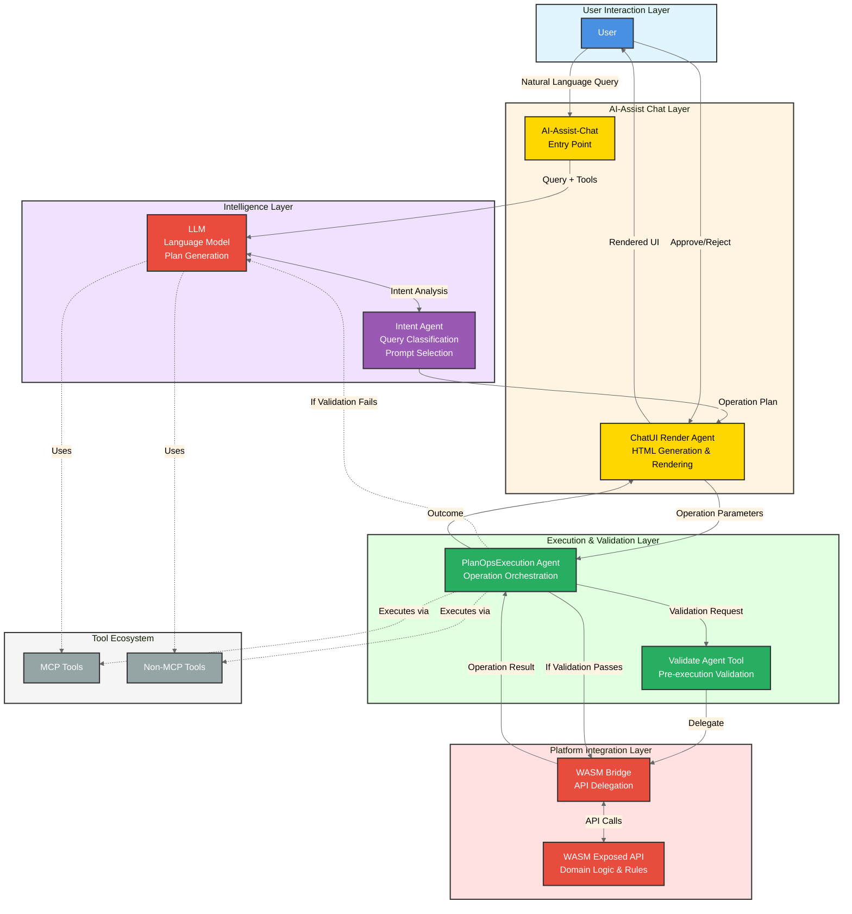
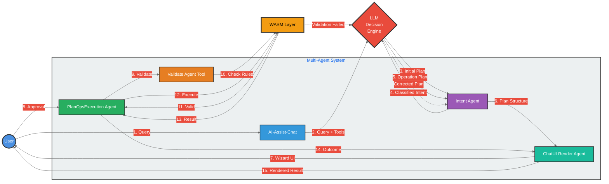
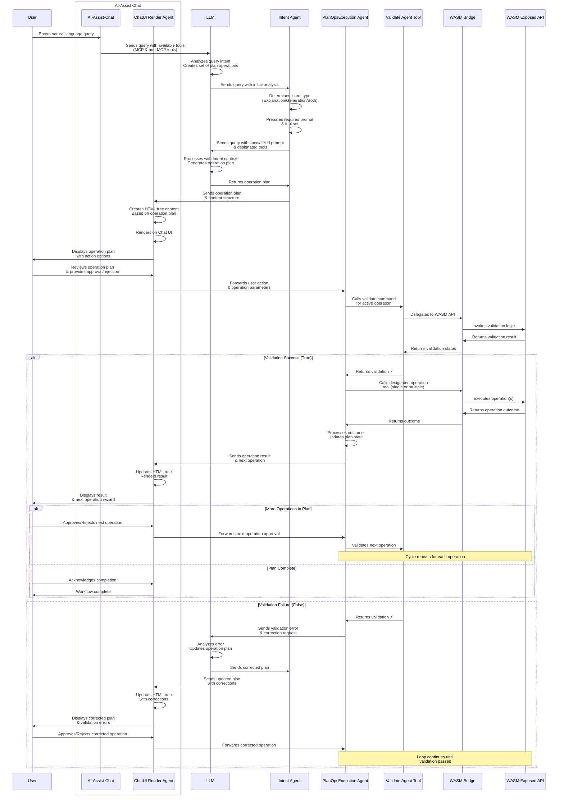

# Design – AI Assist

This is an Active document, will be updated for any new feature and improvement undertaken.

Context
---------
The AI-Assist system provides an intelligent, multi-agent workflow for processing user queries through natural language interaction. The architecture employs a **human-in-the-loop** approach where users approve/reject operations before execution, ensuring controlled automation.

**Key Characteristics:**

- **Intent-Driven Processing**: Specialized Intent Agent determines query type (explanation vs. generation) and routes with appropriate prompts and tool sets
- **Multi-Agent Orchestration**: Distinct agents handle specific concerns—intent detection, UI rendering, plan execution, and validation
- **WASM-Based Validation**: All operations are validated through WASM-exposed APIs before execution, ensuring domain rule compliance
- **Adaptive Correction Loop**: Failed validations trigger automatic plan corrections via LLM, iterating until validation passes
- **Wizard-Style UX**: ChatUI Render Agent creates structured HTML content to guide users through step-by-step operation approval
- **Tool Ecosystem**: Supports both MCP and non-MCP tools, providing flexible integration with platform capabilities
- **Safety-First Execution**: No operation executes without explicit user approval and successful WASM validation

Architecture Overview
---------------------

### Component Architecture Diagram


---
### Agent Interaction Flow


---

Sequence Diagrams
-----------------


---

Schema
------

### PlanOps Envelope Schema

The PlanOps envelope defines the structure for operation plans passed between agents. Each plan contains a summary, ordered operations array, and warnings for execution.

**Schema Location:** [artifacts/ai-assist/planops evelope schema.json](artifacts/ai-assist/planops%20evelope%20schema.json)

```json
{
  "$schema": "http://json-schema.org/draft-07/schema#",
  "$id": "https://qorix.com/schemas/operation-plan.schema.json",
  "title": "OperationPlan",
  "description": "Schema for CRUD operation plans targeting apply_operation() method in Qorix platform. (c) 2026 Qorix",
  "type": "object",
  "required": ["summary", "ops", "warnings"],
  "properties": {
    "summary": {
      "type": "string",
      "description": "High-level description of the entire operation plan and its purpose",
      "minLength": 1,
      "maxLength": 500,
      "examples": [
        "Comprehensive CRUD operation plan for SwcDesign and SignalsComStack models",
        "Batch update operation for vehicle network configuration"
      ]
    },
    "ops": {
      "type": "array",
      "description": "Ordered array of operations to be executed sequentially. Each operation maps to apply_operation(yaml_in, op_json) parameters.",
      "minItems": 1,
      "items": {
        "$ref": "#/definitions/Operation"
      }
    },
    "warnings": {
      "type": "array",
      "description": "Array of warning messages about the operation plan execution, validation rules, or constraints",
      "items": {
        "type": "string",
        "minLength": 1,
        "maxLength": 500
      },
      "examples": [
        [
          "CREATE operations skip validation to allow partial initialization",
          "UPDATE operations require full validation and block on errors",
          "Operations must be executed sequentially for state consistency"
        ]
      ]
    }
  },
  "additionalProperties": false,
  "definitions": {
    "Operation": {
      "type": "object",
      "description": "Single CRUD operation with all required parameters for apply_operation() method",
      "required": ["op_name", "description", "yaml_in", "op_json"],
      "properties": {
        "op_name": {
          "type": "string",
          "description": "Unique identifier for the operation using snake_case naming convention",
          "pattern": "^[a-z][a-z0-9_]*[a-z0-9]$",
          "minLength": 3,
          "maxLength": 100,
          "examples": [
            "create_swc_field",
            "update_signal",
            "delete_bus",
            "read_application"
          ]
        },
        "description": {
          "type": "string",
          "description": "Human-readable explanation of what this operation does and its expected effect",
          "minLength": 10,
          "maxLength": 300,
          "examples": [
            "Create a new field entity in SwcDesign component",
            "Update signal properties like length or byte order",
            "Delete a bus entity from SignalsComStack network"
          ]
        },
        "yaml_in": {
          "type": "string",
          "description": "YAML-formatted input containing the domain model state (SwcDesign or SignalsComStack). Maps to first parameter of apply_operation(yaml_in, op_json).",
          "minLength": 10,
          "pattern": "^(swc_design:|signals_comstack:)",
          "examples": [
            "swc_design:\n  name: \"ExampleComponent\"\n  version: \"1.0.0\"\n  application: []\n  field: []",
            "signals_comstack:\n  name: \"VehicleNetwork\"\n  version: \"1.0.0\"\n  buses: []\n  signals: []\n  ipdus: []"
          ]
        },
        "op_json": {
          "type": "string",
          "description": "JSON-formatted operation specification conforming to UiOpV2 enum structure. Maps to second parameter of apply_operation(yaml_in, op_json). Must be valid JSON containing one of: Create, Update, Delete, or Read operation.",
          "minLength": 10,
          "contentMediaType": "application/json",
          "examples": [
            "{\"Create\": {\"entity_type\": \"Field\", \"parent_id\": null, \"data\": {\"name\": \"newField\", \"type\": \"uint32\"}}}",
            "{\"Update\": {\"entity_type\": \"Field\", \"id\": \"field-uuid-001\", \"updates\": {\"type\": \"uint32\"}}}",
            "{\"Delete\": {\"entity_type\": \"Field\", \"id\": \"field-uuid-999\"}}",
            "{\"Read\": {\"entity_type\": \"Field\", \"id\": \"field-uuid-read-001\"}}"
          ]
        }
      },
      "additionalProperties": false
    }
  },
  "examples": [
    {
      "summary": "Basic field creation operation plan",
      "ops": [
        {
          "op_name": "create_swc_field",
          "description": "Create a new field entity in SwcDesign component",
          "yaml_in": "swc_design:\n  name: \"ExampleComponent\"\n  version: \"1.0.0\"\n  application: []\n  field: []",
          "op_json": "{\"Create\": {\"entity_type\": \"Field\", \"parent_id\": null, \"data\": {\"name\": \"newField\", \"type\": \"uint32\", \"init_value\": \"0\"}}}"
        }
      ],
      "warnings": [
        "CREATE operations skip validation to allow partial initialization",
        "Each operation must be executed with result YAML as input to next"
      ]
    }
  ]
}
```

**Key Schema Elements:**

- **summary** (required): High-level description of the operation plan
- **ops** (required): Array of ordered operations, each containing:
  - `op_name`: Unique snake_case identifier
  - `description`: Human-readable explanation
  - `yaml_in`: YAML-formatted domain model state
  - `op_json`: JSON operation spec (Create/Update/Delete/Read)
- **warnings** (required): Execution rules and constraints

**Usage Flow:**
1. LLM generates operation plan conforming to this schema
2. Intent Agent validates plan structure
3. ChatUI Render Agent presents plan to user
4. PlanOpsExecution Agent executes each operation via WASM bridge
5. Each operation's result YAML becomes input for next operation

### Sample Payload

A complete example demonstrating a multi-step operation plan for creating and updating SwcDesign entities.

**Sample Location:** [artifacts/ai-assist/planops-sample-payload.yaml](artifacts/ai-assist/planops-sample-payload.yaml)

```yaml
summary: "Create SwcDesign component with application and field entities, then update field properties"

ops:
  - op_name: "create_swc_component"
    description: "Initialize a new SwcDesign component with basic metadata"
    yaml_in: |
      swc_design:
        name: "VehicleSpeedController"
        version: "1.0.0"
        application: []
        field: []
    op_json: |
      {
        "Create": {
          "entity_type": "SwcDesign",
          "parent_id": null,
          "data": {
            "name": "VehicleSpeedController",
            "version": "1.0.0",
            "description": "Main controller for vehicle speed management"
          }
        }
      }

  - op_name: "create_application_entity"
    description: "Create an application entity within the SwcDesign component"
    yaml_in: |
      swc_design:
        name: "VehicleSpeedController"
        version: "1.0.0"
        application: []
        field: []
    op_json: |
      {
        "Create": {
          "entity_type": "Application",
          "parent_id": "swc-design-uuid-001",
          "data": {
            "name": "SpeedMonitorApp",
            "type": "RealTimeApp",
            "priority": 10
          }
        }
      }

  - op_name: "create_field_vehicle_speed"
    description: "Create a field entity for storing current vehicle speed value"
    yaml_in: |
      swc_design:
        name: "VehicleSpeedController"
        version: "1.0.0"
        application:
          - name: "SpeedMonitorApp"
            type: "RealTimeApp"
            priority: 10
        field: []
    op_json: |
      {
        "Create": {
          "entity_type": "Field",
          "parent_id": "app-uuid-001",
          "data": {
            "name": "currentSpeed",
            "type": "uint32",
            "init_value": "0",
            "unit": "km/h"
          }
        }
      }

  - op_name: "update_field_speed_limit"
    description: "Update the field to add maximum speed constraint"
    yaml_in: |
      swc_design:
        name: "VehicleSpeedController"
        version: "1.0.0"
        application:
          - name: "SpeedMonitorApp"
            type: "RealTimeApp"
            priority: 10
        field:
          - name: "currentSpeed"
            type: "uint32"
            init_value: "0"
            unit: "km/h"
    op_json: |
      {
        "Update": {
          "entity_type": "Field",
          "id": "field-uuid-001",
          "updates": {
            "max_value": "250",
            "description": "Current vehicle speed with 250 km/h limit"
          }
        }
      }

  - op_name: "create_field_target_speed"
    description: "Create another field for target/desired speed"
    yaml_in: |
      swc_design:
        name: "VehicleSpeedController"
        version: "1.0.0"
        application:
          - name: "SpeedMonitorApp"
            type: "RealTimeApp"
            priority: 10
        field:
          - name: "currentSpeed"
            type: "uint32"
            init_value: "0"
            unit: "km/h"
            max_value: "250"
            description: "Current vehicle speed with 250 km/h limit"
    op_json: |
      {
        "Create": {
          "entity_type": "Field",
          "parent_id": "app-uuid-001",
          "data": {
            "name": "targetSpeed",
            "type": "uint32",
            "init_value": "0",
            "unit": "km/h",
            "max_value": "250",
            "description": "Desired target speed for cruise control"
          }
        }
      }

warnings:
  - "CREATE operations skip validation to allow partial initialization"
  - "UPDATE operations require full validation and block on errors"
  - "Operations must be executed sequentially for state consistency"
  - "Each operation's output YAML becomes input for the next operation"
  - "Validation errors trigger automatic plan correction via LLM"
  - "User approval required before executing each operation"
```

**Sample Highlights:**

- **5 Sequential Operations**: Create component → Create application → Create field → Update field → Create another field
- **State Progression**: Each operation's `yaml_in` reflects the cumulative state from previous operations
- **Mixed CRUD**: Demonstrates both CREATE and UPDATE operations
- **Domain Context**: SwcDesign domain with realistic vehicle speed controller scenario
- **Validation Rules**: Comprehensive warnings covering execution constraints

---