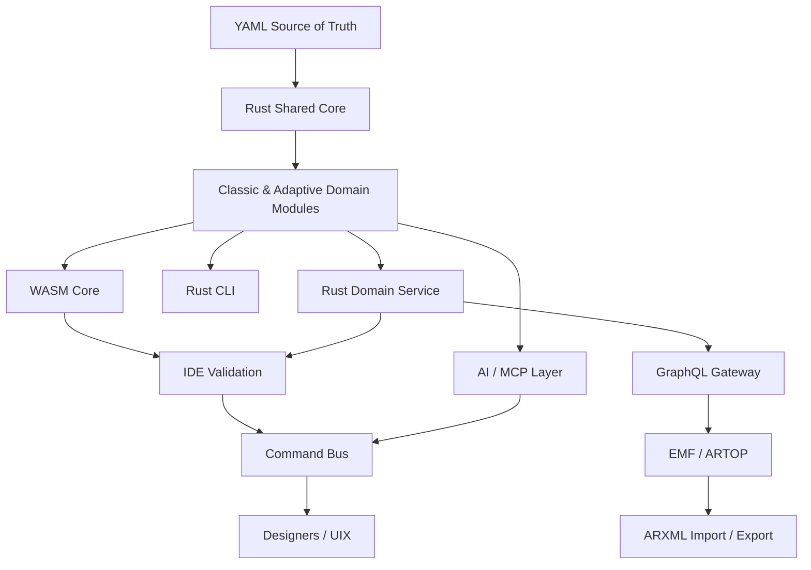

# Qorix Developer – Stepwise Development from Core to UIX

This document describes a **bottom-up, dependency-safe development sequence** for Qorix Developer, starting from the foundational domain core and progressing systematically to UI/UX (UIX). The steps align with the C4 architecture and are intended to be executed sequentially.

---

## 1. Define the Source of Truth (YAML-first Contract)

**Objective**
Establish YAML as the authoritative authoring format. ARXML is treated strictly as an interoperability format.

**Key Decisions**

* Git repositories store YAML only
* ARXML is generated/imported via controlled gateways
* Partial and incomplete YAML must be valid during authoring

**Deliverables**

* YAML project layout (Classic + Adaptive)
* JSON Schema / meta-schema strategy

**Acceptance Criteria**

* YAML files load in IDE with structural validation and completion

---

## 2. Implement Shared Rust Core (Foundation Layer)

**Objective**
Create reusable primitives used uniformly by CLI, WASM, services, AI, and IDE.

**Core Crates**

* `core::model` – identifiers, qualified names, base datatypes, errors
* `core::yaml` – serde mapping, partial-document tolerance
* `core::validation` – rule engine + diagnostics (with YAML paths)
* `core::ops` – add/update/delete operations + higher-level domain ops

**Acceptance Criteria**

* Given YAML input, Rust produces deterministic diagnostics with exact YAML paths

---

## 3. Add GraphQL Client Abstraction (Rust-side)

**Objective**
Decouple Rust from EMF/ARTOP by communicating exclusively via GraphQL.

**Deliverables**

* `core::gql_client` generated from GraphQL schema
* Supported operations:

  * `importArxml`
  * `exportArxml`
  * `applyOps`

**Acceptance Criteria**

* Rust core compiles and runs against a mocked GraphQL endpoint

---

## 4. Implement Domain Modules (Classic & Adaptive)

**Objective**
Layer AUTOSAR-specific semantics and rules on top of the shared core.

**Classic Modules**

* SWC, ECUC/BSW, OS, RTE, NvM, ComStack

**Adaptive Modules**

* Applications
* Service Interfaces
* Machine Manifest
* Execution & Deployment
* Platform Services

**Acceptance Criteria**

* Stack-specific validation rules trigger correctly (Classic vs Adaptive)

---

## 5. Compile WASM Target for Fast IDE Validation

**Objective**
Enable zero-latency, offline validation inside the IDE.

**Exports**

* `validateYaml(stack, docs) -> diagnostics`
* `planOps(stack, docs, intent) -> operationPlan`

**Acceptance Criteria**

* IDE validation runs fully client-side with no network dependency

---

## 6. Implement Rust CLI (CI / Headless Path)

**Objective**
Reuse the same domain logic for automation and CI pipelines.

**Commands**

* `qorix validate`
* `qorix generate-arxml`
* `qorix migrate --from-arxml`

**Acceptance Criteria**

* CLI output matches IDE validation results exactly

---

## 7. Implement Rust Domain Service (Heavy Operations)

**Objective**
Support long-running, stateful, or resource-intensive operations.

**Endpoints**

* `/validate`
* `/planOps`
* `/applyOpsAndSync`

**Acceptance Criteria**

* Designers and commands can offload heavy tasks to the service

---

## 8. Build ARXML Gateway (Spring Boot + ARTOP)

**Objective**
Isolate EMF/ARTOP behind a stable GraphQL boundary.

**Components**

* EMF repository (multi-file ARXML)
* Import / Export services
* AUTOSAR version normalization

**Acceptance Criteria**

* Full roundtrip works:

  * ARXML → YAML
  * YAML → ARXML

---

## 9. Implement Ops Apply & Sync Pipeline

**Objective**
Apply Rust-generated operations into EMF models deterministically.

**Flow**

* Rust computes `Ops[]`
* GraphQL `applyOps`
* EMF updated
* ARXML serialized

**Acceptance Criteria**

* IDE and CLI exports are byte-consistent

---

## 10. Add AI / MCP Layer (Safe-by-Construction)

**Objective**
Allow AI assistance without direct file mutation.

**Principles**

* AI never edits YAML directly
* AI calls Rust tools
* Rust returns structured operation plans

**Acceptance Criteria**

* AI suggestions produce previewable ops + re-validation

---

## 11. Build IDE Base (VS Code / Theia)

**Objective**
Provide a command-driven IDE that delegates all semantics to Rust/WASM.

**Key Elements**

* YAML editor + schema completion
* Diagnostics panel
* Internal command bus

**Acceptance Criteria**

* Editing YAML triggers immediate validation and diagnostics

---

## 12. Add Designers (UIX Layer)

**Objective**
Introduce visual editors bound strictly to YAML files.

**Recommended Order**

1. Adaptive Application Designer
2. Machine Manifest Designer
3. Deployment / Execution Designer
4. Classic SWC → OS → RTE → ComStack

**UX Rules**

* Canvas actions emit commands
* Commands generate ops
* Ops update YAML
* WASM re-validates

**Acceptance Criteria**

* Visual edits are fully traceable to YAML diffs and validations

---

## Mermaid Diagram – End-to-End Build-Up Flow

---

## Summary

This sequence ensures:

* Single source of truth (YAML)
* Deterministic behavior across IDE, CLI, AI, and CI
* Clear separation of concerns (domain vs UI vs interoperability)
* Scalable addition of UIX without architectural erosion

